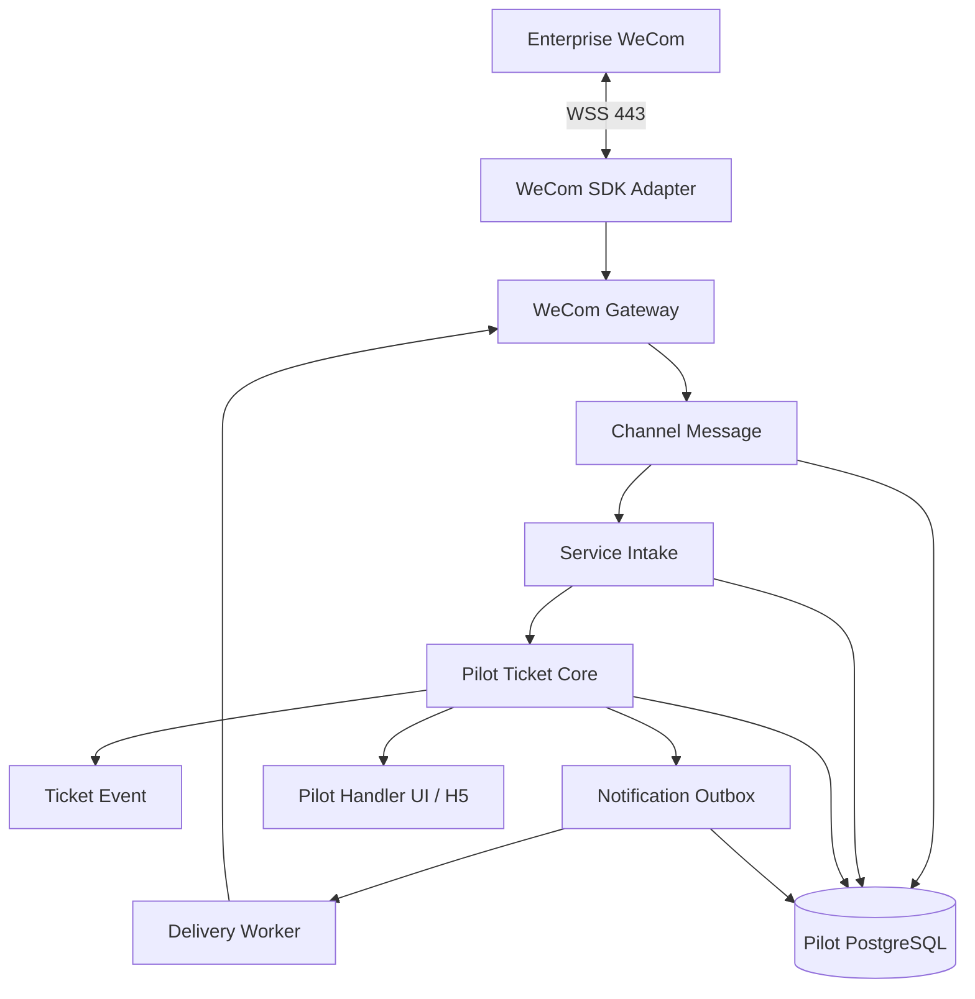
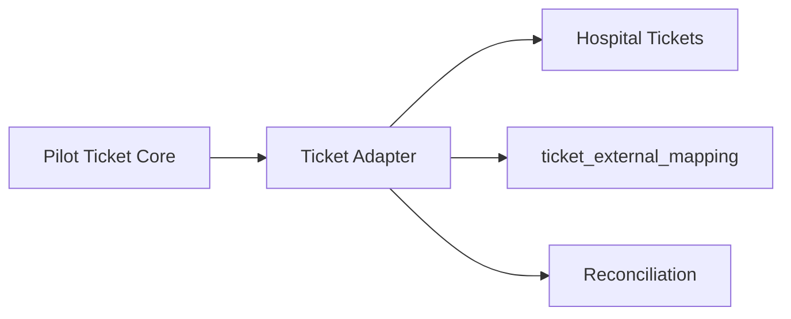

# 02. V1.2 总体技术架构

## 1. 架构目标

- 企业微信连接稳定且可验证；
- 消息先持久化再回复；
- Channel Message、Service Intake、Ticket、Incident 分层；
- Phase 1 在公网独立完成 Pilot 闭环；
- AI/OCR 不在关键路径；
- Phase 3 通过 Adapter 迁移至 Hospital Tickets；
- 不形成长期双工单事实源；
- 适合少量开发运维人员。

## 2. Phase 1：公网试点架构



固定链路：

```text
Enterprise WeCom
→ WeCom Gateway
→ Channel Message
→ Service Intake
→ Pilot Ticket Core
```

Phase 1 不依赖 Hospital Tickets、医院 SSO、医院 Hub、医院 API 平台或院内 Outbox。试点身份、处理组和通知能力在最小 Pilot 边界内提供。

## 3. Phase 2：异步增强

```text
Service Intake
→ rules / catalog
→ private media / OCR
→ AI Triage suggestion
→ AIDecision
→ human correction
```

AI/OCR：

- 只产生建议；
- 不决定明确报修是否建单；
- 不直接修改 Ticket/Incident；
- 不执行生产工具；
- 可单独关闭；
- 失败时进入人工分诊。

## 4. Phase 3：医院融合架构



固定迁移路径：

```text
Pilot Ticket Core
→ Ticket Adapter
→ Hospital Tickets
```

Ticket Adapter 负责：

- 双方 Contract 隔离；
- 幂等创建和重放；
- 编号、状态、事件、人员、处理组、备注和附件映射；
- `ticket_external_mapping`；
- 迁移批次、异常队列和逐对象对账；
- 通知所有权切换；
- 受控回滚。

切换完成后：

- Hospital Tickets 是唯一长期工单事实源；
- Pilot Ticket Core 停止正式写入；
- Pilot 历史按批准方案只读或归档；
- 不允许长期双写或双向无主同步。

## 5. 服务职责

### 5.1 WeCom Gateway

负责连接、认证、心跳、重连、消息接收、基础校验、调用 Intake、回复与主动推送。不得承载工单状态机、AI分类或医院工单同步。

### 5.2 WeCom SDK Adapter

隔离官方 SDK Frame、错误码、媒体和卡片差异。业务模块只依赖内部消息和发送契约。

### 5.3 Channel Message

保存企业微信原始消息事实，使用 `provider + msg_id` 幂等；原始证据不可被 AI 结果覆盖。

### 5.4 Service Intake

负责一次服务受理、上下文聚合、身份/位置快照、创建或追加 Ticket、触发异步增强及关联 Incident。

### 5.5 Pilot Ticket Core

Phase 1/2 负责工单编号、状态机、处理组、事件、内外部备注、解决确认、重开和审计。它不等于企业微信消息模型，也不是长期医院工单替代品。

### 5.6 Notification Outbox / Delivery

Outbox 与业务状态同事务；Delivery 异步发送、重试、限流、去重、死信并记录实际送达。

### 5.7 Incident / Subscription

保留各 Intake 证据，通过 Incident 关联公共故障，并维护每位申报人的通知订阅。默认人工确认。

### 5.8 Ticket Adapter

只在 Phase 3 实现。不得由 Gateway 代替，也不得通过共享数据库直写实现。

## 6. 关键数据流

### Phase 1 首次报修

```text
WeCom Frame
→ Normalized Message
→ Channel Message（幂等持久化）
→ Service Intake
→ Pilot Ticket + Ticket Event + Outbox（事务）
→ Commit
→ 回复 Pilot 工单号
```

### Phase 2 增强

```text
Committed Intake
→ rules / OCR / AI
→ AIDecision
→ human review
```

### Phase 3 迁移与切换

```text
Pilot Ticket snapshot/event
→ Ticket Adapter
→ Hospital Ticket
→ ticket_external_mapping
→ reconciliation
→ source-of-truth cutover
```

## 7. 故障边界

| 故障 | 行为 |
|---|---|
| AI/OCR 不可用 | Phase 1 正常受理，人工分诊 |
| Redis 不可用 | 关闭非关键缓存/聚合，不丢数据库事实 |
| 媒体存储不可用 | 文字仍建单，媒体重试并告警 |
| Pilot Ticket Core 不可用 | Channel Message 已落库，进入可靠待补建；不得虚构工单号 |
| 企业微信断线 | 重连；Outbox 等待恢复后发送 |
| 通知失败 | Delivery 重试，不回滚 Ticket 事实 |
| Phase 3 Hospital Tickets 不可用 | Adapter 重试/死信/对账；按已批准切换状态决定回滚或暂停 |
| 映射冲突 | 阻止自动覆盖，进入人工对账 |

## 8. 明确不采用

- Phase 1 直接复用 Hospital Tickets；
- 企业微信 Frame 直接作为 Ticket；
- AI 前置建单；
- 共享数据库直写 Hospital Tickets；
- 长期 Pilot/Hospital 双事实源；
- 当前规模下的 Kafka、Kubernetes 或复杂多 Agent 编排。
