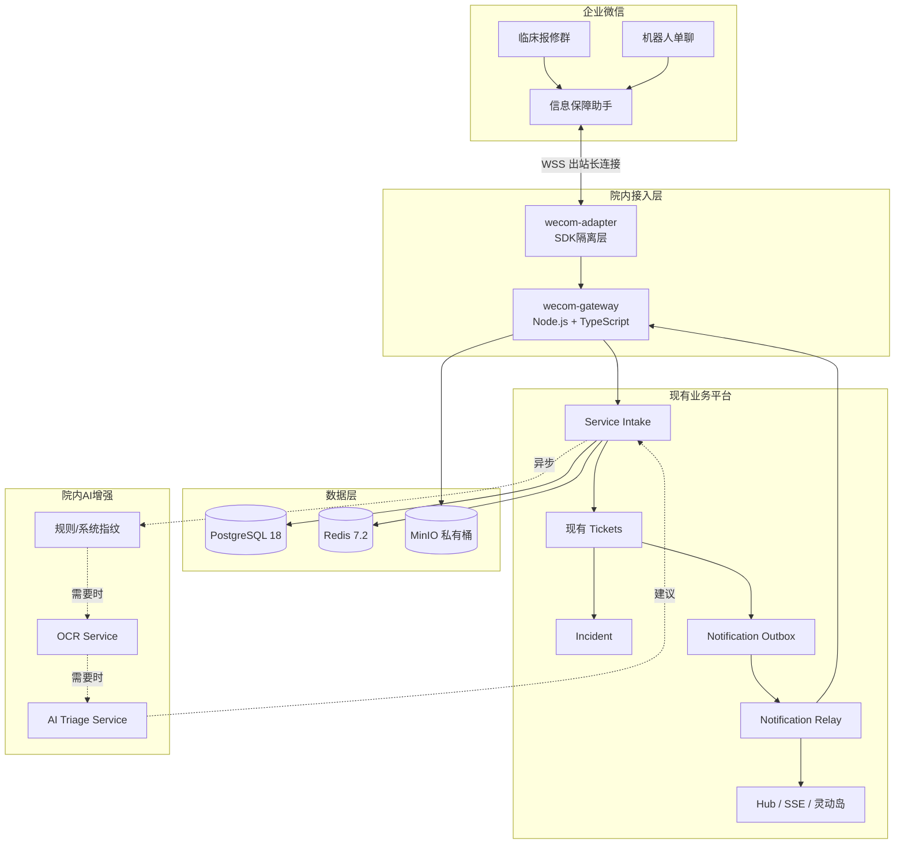

# 02. 总体技术架构

## 1. 架构目标

架构需同时满足：

- 企业微信连接稳定；
- 消息先持久化；
- 复用现有 Tickets 和 Hub；
- AI 不在关键路径；
- 适合少量开发运维人员；
- 院内数据闭环；
- 支持多院区；
- 支持未来扩展到全院服务中心。

## 2. 逻辑架构



## 3. 服务职责

### 3.1 `wecom-gateway`

负责：

- WebSocket 建连、认证、心跳、重连；
- SDK 事件监听；
- 消息标准化；
- 媒体下载和解密；
- 调用 Intake API；
- 被动回复和主动推送；
- 卡片事件；
- 连接健康指标。

不负责：

- 工单状态机；
- AI 分类；
- 处理组业务规则；
- 直接修改 Tickets 数据库；
- 公共故障自动判定。

### 3.2 `wecom-adapter`

用于隔离官方 SDK：

- SDK 消息类型到内部 Contract 的转换；
- SDK 异常转换为稳定错误码；
- 主动发送和卡片构造封装；
- 下载、解密和媒体上传封装；
- 便于锁定或升级 SDK 版本。

业务模块不得直接依赖 SDK 原始 Frame 类型。

### 3.3 `Service Intake`

负责：

- 消息幂等；
- 原始消息持久化；
- 多条消息上下文聚合；
- 身份、院区、科室上下文；
- 创建或追加工单；
- 触发异步识别；
- 关联 Incident；
- 记录服务受理状态。

### 3.4 现有 `Tickets`

负责：

- 工单编号；
- 工单状态机；
- 处理组和处理人；
- SLA；
- 时间线；
- 内外部备注；
- 解决、确认、重开；
- 业务事件；
- 权限和审计。

### 3.5 `Incident`

负责：

- 公共故障生命周期；
- 多个 Intake 的关联；
- 多个处理任务的关联；
- 多申报人订阅；
- 公共公告和重要进展；
- 解除错误关联。

### 3.6 `Notification Outbox/Relay`

负责：

- 业务事务内记录待发送事件；
- 异步发送；
- 重试；
- 限流；
- 去重；
- 死信；
- 送达审计；
- 企业微信和 Hub 多通道分发。

### 3.7 `AI Triage Service`

负责：

- OCR；
- 错误代码和系统指纹；
- 结构化分类；
- 缺失字段；
- 处理组建议；
- 公共故障相似性建议；
- 影子评估。

AI 不能直接修改 Ticket 或 Incident。

## 4. 关键数据流

### 4.1 首次报修

```text
WeCom Frame
→ NormalizedWeComMessage
→ channel_message
→ service_intake
→ Tickets API
→ notification_outbox
→ Commit
→ 回复工单号
→ 异步识别
```

### 4.2 状态通知

```text
工程师 Action
→ Tickets 校验状态和权限
→ ticket_event + ticket.version + outbox 同事务
→ Relay
→ 机器人单聊/群公告
→ notification_delivery
```

### 4.3 图片

```text
企业微信图片消息
→ Gateway 下载和 AES 解密
→ 文件类型、大小、病毒检查
→ MinIO 私有桶
→ media_asset
→ OCR 异步
→ 敏感信息标记
→ 结构化字段建议
```

## 5. 故障边界

| 故障 | 核心行为 |
|---|---|
| AI 不可用 | 正常建单，进入人工分诊 |
| OCR 不可用 | 图片保留，提示补充文字 |
| Redis 不可用 | 关闭短期聚合，不影响 PostgreSQL 受理 |
| MinIO 不可用 | 文本仍建单，图片进入待补存队列并告警 |
| Tickets 不可用 | 消息已落库，Intake 标记待补建，重试 |
| 企业微信断线 | SDK 重连，健康告警；已落库的 Outbox 待恢复后发送 |
| 主动推送失败 | 重试并记录 Delivery，不回滚工单状态 |
| 身份无法映射 | 以 WeCom userid 建 Intake，进入管理员映射队列 |
| 公共故障误关联 | 解除关联，原 Intake 和 Ticket 不丢失 |

## 6. 部署原则

- Gateway 与业务服务逻辑分离；
- Gateway 只保留一个活动 WebSocket 连接，备用实例待命；
- PostgreSQL 是主事实源；
- Redis 非关键依赖；
- AI 服务可单独关闭；
- MinIO 私有访问；
- 不暴露公网 HTTP 回调作为主方案；
- 企业微信移动端 H5 网络路径必须在 Gate 或 Phase 2 验证。

## 7. 不采用的方案

### 7.1 Windows 客户端 RPA

不作为生产主链路，原因包括掉线、锁屏、版本变化、焦点错误、身份和消息 ID 不可靠。

### 7.2 新建第二套工单系统

会造成状态、权限、人员、统计和审计双重事实源。

### 7.3 AI 前置建单

会让模型超时或异常转化为临床漏单。

### 7.4 Kafka/Kubernetes

当前吞吐和人力不需要。优先使用 PostgreSQL Inbox/Outbox、Worker 和 Redis 辅助。
