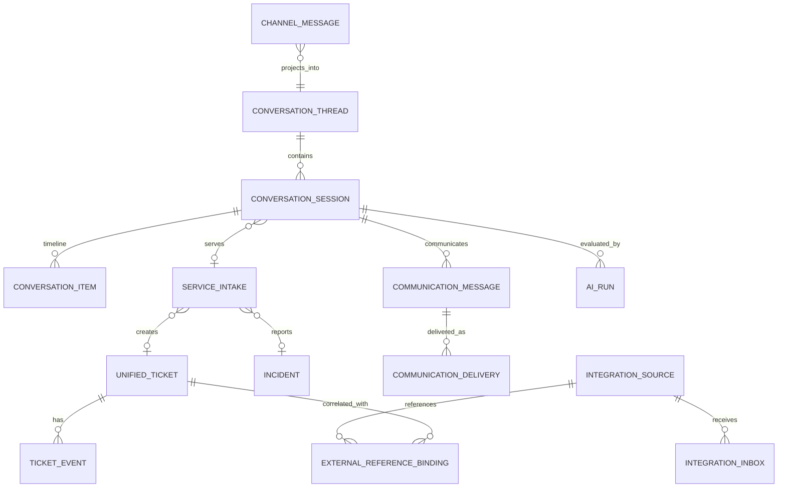

# 04. 领域模型与系统边界 V1.4

## 1. 核心对象

### ChannelMessage

企业微信原始消息事实。以 `provider + msg_id` 幂等，不被 AI 或投影覆盖。

### ConversationThread

某个渠道长期通信线程。单聊按 Bot+User，群聊按 Bot+Chat 建立。

### ConversationSession

一次连续服务话题，是 AI 上下文、人工接管和 Service Intake 的主要边界。群聊必须附带参与者隔离键。

### ConversationItem

由 Channel Message、Communication Message、Ticket Event 和系统事件投影形成的统一时间线项目。它不是第二份原始消息事实。

### ServiceIntake

一次完整服务受理，可包含多条消息和附件，最多创建一张主 Ticket，可关联 Incident。

### UnifiedTicket

唯一工单事实源，负责编号、状态、优先级、处理组、处理人、事件、内外部备注、关闭原因和版本。

当前物理实现可继续位于 `pilot_ticket.*`。

### Incident

多个独立 Intake 背后的公共故障。关联不删除任何个人 Intake 或原始证据。

### ReporterSubscription

用户对 Ticket 或 Incident 的通知关系。

### CommunicationMessage / Outbox / Delivery

统一表达人工、AI 和 Ticket 通知的外部通信。内部备注不得形成外部 Delivery。

### AIJob / AIRun / ConversationMemory

保存可重放任务、模型调用、结果状态、Generation Version、Token 成本、滚动摘要和结构化记忆。AI 记录只追加。

### IntegrationSource

未来内网门户、医院 API、监控告警等新来源的注册信息。

### IntegrationInbox

保存外部事件，按 `source + external_event_id` 幂等、校验、隔离和重放。

### ExternalReferenceBinding

关联外部请求/告警/消息标识与本地 Intake/Ticket，仅保存跨来源引用事实，不是第二套 Ticket。

### IntegrationOutbox / SyncCursor / Reconciliation

用于外部投影、断点续传和运行时一致性核验。V1.4 不包含历史 Ticket 批次或最终切换语义。

### IdentityBinding

企业微信、SSO、person、employee、任职、科室、院区和角色之间的有效期映射。

## 2. 关系

## 3. 核心不变量

1. ChannelMessage 一经保存不可覆盖。
2. 每个明确报修至少形成 Intake。
3. Ticket 状态只能通过 Action 转换。
4. Ticket Event 追加不可变。
5. Outbox 与业务事实同事务。
6. 人工接管递增 Generation Version。
7. 过期 AI 结果不得发送。
8. 内部备注不得外发。
9. Incident 不删除个人 Intake。
10. 外部来源不拥有 Ticket 状态。
11. ExternalReferenceBinding 不得演化为第二套 Ticket。
12. 当前无历史 Ticket，P3 不建设历史兼容模型。
13. P1 不依赖医院内网。
14. AI/OCR/Connector 关闭时核心链路可用。
