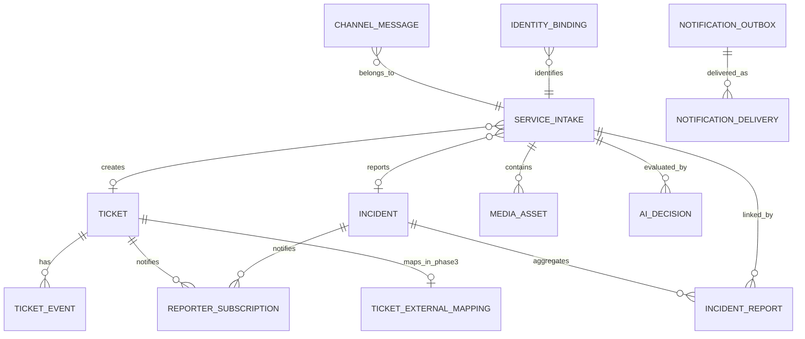

# 04. 领域模型与系统边界

## 1. 为什么需要独立领域对象

本领域模型与工单后端解耦：Phase 1/2 的 Ticket 由 Pilot Ticket Core 管理；Phase 3 通过 Ticket Adapter 映射到 Hospital Tickets。

企业微信消息、服务受理、工单和公共故障表达的是不同事实：

- 消息：用户说了什么；
- Intake：系统受理了什么服务请求；
- Ticket：处理团队需要做什么；
- Incident：多个申报背后的共同故障；
- Subscription：谁需要持续收到进展。

把这些对象混成一张表，会导致原始证据丢失、并单后无法追溯、多申报人通知混乱。

## 2. 核心对象

### 2.1 ChannelMessage

表示企业微信传入的一条原始消息。

关键属性：

- provider；
- msg_id；
- idempotency_key（固定为 `provider + msg_id`）；
- req_id；
- chat_type；
- chat_id；
- sender_user_id；
- msg_type；
- 有序 content（text/media）；
- quote；
- create_time（提供方可缺省）；
- received_at；
- raw_payload；
- privacy_class；
- retention_until。

不负责：

- 工单状态；
- 最终分类；
- 处理人；
- 公共故障状态。

### 2.2 ServiceIntake

表示一次完整受理，可包含多条消息和附件。

关键属性：

- intake_no；
- source_channel；
- reporter；
- 原始上下文；
- 请求类型；
- 标准摘要；
- 院区、科室和位置；
- ticket_id；
- incident_id；
- intake_status。

一个 Intake：

- 至少包含一条 ChannelMessage；
- 最多关联一张主工单；
- 可关联一个 Incident；
- 可追加补充消息；
- 可因咨询或无效请求不生成 Ticket，但必须保留处理结论。

P1-004 的可执行边界由 `intake.service_intake`、`intake.service_intake_message` 和 `intake.service_intake_event` 三张表实现。Channel Message 仍是不可被 Intake 覆盖的通道事实；每条 Channel Message 最多属于一个 Intake，关系显式区分 `PRIMARY`、`SUPPLEMENT` 和 `CLARIFICATION`。P1-004 的 `ticket_id`、`incident_id` 公开值固定为空，实际关联列与外键分别留给 P1-005 和 Phase 2 的受权任务。

### 2.3 Ticket

表示需要处理团队完成的任务。

Phase 1/2 由 Pilot Ticket Core 管理；Phase 3 切换后由 Hospital Tickets 管理，并通过外部映射保持追溯：

- 标题；
- 类型；
- 状态；
- 优先级；
- 处理组；
- 处理人；
- SLA；
- 事件时间线；
- 内部备注；
- 外部结果；
- 关闭原因；
- version。

一个 Ticket 可由一个 Intake 创建，也可承载 Incident 下的处理任务。

### 2.4 Incident

表示多个申报共同对应的公共故障。

关键属性：

- incident_no；
- system/module；
- 症状和错误特征；
- 影响范围；
- 状态；
- 严重等级；
- 主要处理任务；
- 公告；
- 监控信号；
- 关联 Intake；
- 订阅人。

Incident 不等于重复 Ticket 合并。每个 Intake 仍保留。

### 2.5 ReporterSubscription

表示某个用户对 Ticket 或 Incident 的通知关系。

关键属性：

- wecom_userid；
- ticket_id 或 incident_id；
- 通知渠道；
- 最后通知版本；
- 是否退订；
- 送达偏好。

### 2.6 MediaAsset

表示一张图片、文件或处理附件。

关键属性：

- object_key；
- SHA256；
- MIME；
- 文件大小；
- 安全扫描状态；
- 敏感级别；
- 是否允许对申报人展示；
- 留存到期时间。

### 2.7 IdentityBinding

企业微信账号与医院人员主数据的映射。

Phase 1 只要求 WeCom userid 与 Pilot 角色/处理组；医院 person_id、SSO和组织主数据属于 Phase 3 映射，不得成为 Phase 1 建单条件。

必须区分：

- 企业微信 userid；
- 医院 person_id；
- SSO username；
- 任职关系；
- 所属院区；
- 所属科室；
- 有效期。

### 2.8 AIDecision

保存 AI/OCR 结果和人工修正。

关键属性：

- pipeline_version；
- model_name/version；
- prompt_version；
- input_hash；
- OCR 脱敏文本；
- structured_output；
- decision_band；
- 人工修正字段；
- latency。

### 2.9 NotificationOutbox / Delivery

Outbox 表示“应该发送什么”，Delivery 表示“实际发送结果”。

不得将二者混成一个状态字段，否则无法表达多目标、多次重试和部分成功。

### 2.10 TicketExternalMapping

仅在 Phase 3 启用，表示 Pilot Ticket 与 Hospital Ticket 的可审计映射。

关键属性：

- pilot_ticket_id；
- hospital_ticket_id；
- hospital_ticket_no；
- adapter_version；
- migration_batch_id；
- sync_state；
- last_reconciled_at；
- cutover_state。

该对象不能成为第三套工单事实，只保存跨系统身份、同步和对账事实。

## 3. 关系图



## 4. 核心不变量

1. `ChannelMessage` 一经保存不可被 AI 结果覆盖。
2. `provider + msg_id` 唯一。
3. 每个明确报修至少形成一个 Intake。
4. Ticket 状态只能通过 Action 转换。
5. Ticket 状态和对应 Outbox 同事务。
6. Incident 关联不删除 Intake 和原 Ticket 证据。
7. AI Decision 只能追加，不能覆盖历史版本。
8. 外部可见附件和内部附件显式区分。
9. 申报人所属科室不自动等于故障发生科室。
10. 任何自动路由和自动关联都可人工撤销并留痕。
11. Phase 1 Ticket 不得依赖 Hospital Tickets 标识或可用性。
12. Phase 3 切换完成后不得继续把 Pilot Ticket 作为正式长期写入事实源。

## 5. 请求类型

建议枚举：

```text
INCIDENT
SERVICE_REQUEST
QUESTION
COMPLAINT
STATUS_QUERY
FOLLOW_UP
CHATTER
UNKNOWN
```

当前项目优先处理 `INCIDENT`，但保留其他类型以避免把咨询和服务申请误当故障。

## 6. 领域事件

核心事件：

```text
intake.received
intake.ticket_created
intake.needs_clarification
ticket.accepted
ticket.started
ticket.waiting_requester
ticket.resolved
ticket.closed
ticket.reopened
incident.candidate_detected
incident.confirmed
incident.updated
incident.resolved
notification.delivery_failed
ai.degraded
wecom.disconnected
```

事件字段详见 `contracts/domain_events.md`。
