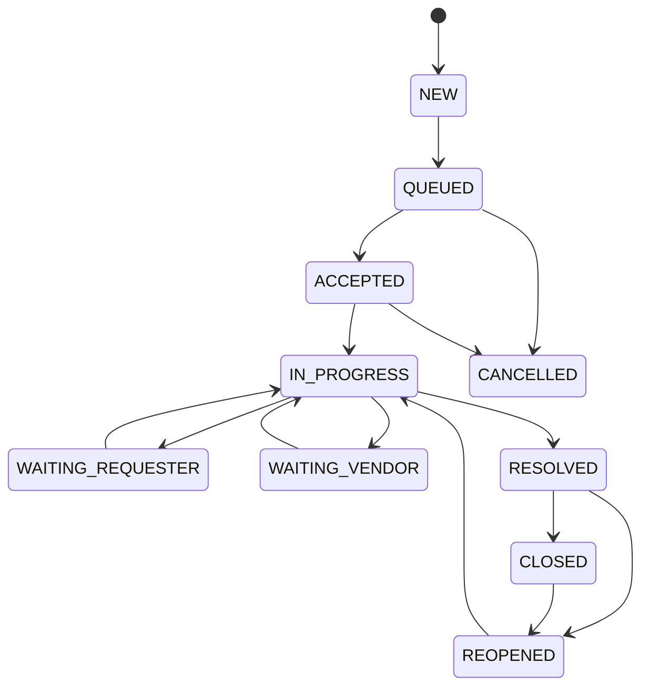

# 06. 工单状态机与通知规则

本状态机在 Phase 1/2 由 Pilot Ticket Core 执行。Phase 3 必须通过已批准的状态映射迁移到 Hospital Tickets，不得在 Gateway 中直接修改医院工单状态。

## 1. 状态设计原则

状态必须表达真实事实，不能为了“让临床感觉有人处理”而提前改变语义。

错误示例：

```text
工单刚创建、无人接单，却回复“正在处理”
```

正确示例：

```text
已收到并生成工单，当前状态：等待受理
```

## 2. 内部状态枚举

```text
NEW
QUEUED
ACCEPTED
IN_PROGRESS
WAITING_REQUESTER
WAITING_VENDOR
RESOLVED
CLOSED
REOPENED
CANCELLED
DUPLICATE_LINKED
```

### 2.1 状态定义

| 状态 | 定义 |
|---|---|
| NEW | 工单对象刚创建，尚未进入处理池 |
| QUEUED | 已进入待处理池 |
| ACCEPTED | 具体处理人已确认接单 |
| IN_PROGRESS | 处理人已开始实际处置 |
| WAITING_REQUESTER | 等待申报人补充 |
| WAITING_VENDOR | 等待厂商或第三方 |
| RESOLVED | 技术处理结束，等待申报人确认 |
| CLOSED | 用户确认、管理员关闭或超时自动关闭 |
| REOPENED | 用户反馈仍未恢复 |
| CANCELLED | 撤销、误报或无效请求 |
| DUPLICATE_LINKED | 作为重复申报关联到 Incident/主任务 |

## 3. 对外状态映射

| 内部状态 | 对外显示 |
|---|---|
| NEW/QUEUED | 等待受理 |
| ACCEPTED | 已受理 |
| IN_PROGRESS | 处理中 |
| WAITING_REQUESTER | 待您补充 |
| WAITING_VENDOR | 处理中 |
| RESOLVED | 已处理，待确认 |
| CLOSED | 已关闭 |
| REOPENED | 重新处理中 |
| CANCELLED | 已撤销 |
| DUPLICATE_LINKED | 已关联公共故障 |

## 4. 合法转换



任何未列出的转换返回 `INVALID_STATE_TRANSITION`。

P1-010 明确保留已关闭工单的重开入口：申报人可将 `CLOSED`（包括
`REQUESTER_CONFIRMED` 与 `AUTO_TIMEOUT`）转为 `REOPENED`，随后由处理人
通过 `start` 进入 `IN_PROGRESS`；`CANCELLED` 不允许通过重开绕过原有处置。
`DUPLICATE_LINKED` 的转换须等 Phase 2 形成可审计 Incident/主任务事实后再由受权任务
定义，P1 不生成该状态。

## 5. Action API

禁止通用：

```http
PATCH /tickets/{id}
{"status":"CLOSED"}
```

必须使用明确动作：

```text
accept
start
request-information
resume
wait-vendor
resolve
confirm
reopen
cancel
```

每次 Action 请求包含：

- expected_version；
- note；
- external_visible；
- attachments；
- reason_code。

## 6. 乐观锁

Ticket 具有整数 `version`。

处理规则：

```text
UPDATE ticket
SET status=?, version=version+1
WHERE id=? AND version=expected_version
```

更新行数为 0 时返回：

```text
TICKET_VERSION_CONFLICT
```

用于防止：

- 卡片重复点击；
- 多个工程师同时接单；
- 旧页面覆盖新状态；
- 解决后又被旧操作改回处理中。

## 7. 事件时间线

每次状态变化写 `ticket_event`：

```text
event_type
old_status
new_status
operator_type
operator_id
internal_note
external_note
reason_code
attachment_ids
created_at
trace_id
```

内部备注和外部说明必须分开。

## 8. Outbox 事务

Phase 1 使用 Pilot Outbox；不得依赖医院院内 Outbox。Phase 3 切换通知所有权时必须完成积压对账和去重。

状态、事件和通知必须在同一事务：

```text
BEGIN
  update ticket
  insert ticket_event
  insert notification_outbox
COMMIT
```

事务提交失败，不发送通知。

企业微信发送失败，不回滚已经发生的工单事实，由 Relay 重试。

## 9. 通知矩阵

| 事件 | 群内 | 申报人单聊 | 信息科内部 |
|---|---:|---:|---:|
| intake.ticket_created | 是 | 可选 | 是 |
| ticket.accepted | 可选 | 是 | 是 |
| ticket.started | 否 | 是 | 是 |
| ticket.waiting_requester | 否 | 是 | 是 |
| ticket.waiting_vendor | 否 | 可选 | 是 |
| ticket.resolved | 可选 | 是 | 是 |
| ticket.closed | 否 | 是 | 是 |
| ticket.reopened | 否 | 是 | 是 |
| incident.confirmed | 是 | 是 | 是 |
| incident.updated | 重要进展才发 | 是 | 是 |
| incident.resolved | 是 | 是 | 是 |

## 10. 首次回复文案

```text
@张医生，问题已收到并生成工单 IT-20260820-0013。
当前状态：等待受理。
初步描述：HIS 登录异常。
```

若 AI 尚未完成，不显示不确定的分类。

## 11. 接单文案

```text
工单 IT-20260820-0013 已由信息科王工受理。
```

只有状态进入 `ACCEPTED` 才发送。

## 12. 开始处理文案

```text
工单 IT-20260820-0013 已开始处理。
```

只有状态进入 `IN_PROGRESS` 才发送。

## 13. 待补充文案

```text
工单 IT-20260820-0013 需要您补充：
1. 终端编号；
2. 是否只有该终端出现。

[补充信息] [查看工单]
```

## 14. 解决确认

```text
工单 IT-20260820-0013 已处理完成。
处理结果：已重新同步账号权限。

[已恢复] [仍未恢复] [查看详情]
```

### 已恢复

- `RESOLVED → CLOSED`
- `closure_reason=REQUESTER_CONFIRMED`

### 仍未恢复

- `RESOLVED → REOPENED`
- 生成事件；
- 通知原处理人和处理组；
- 后续进入 `IN_PROGRESS`。

## 15. 自动关闭

自动关闭策略配置化：

- 默认 24 或 48 小时，由服务目录决定；
- 关闭前发送一次提醒；
- 自动关闭标记 `AUTO_TIMEOUT`；
- 不计为“用户确认解决率”；
- 保留重新打开入口；
- 核心临床故障可禁止自动关闭。

## 16. 群内降噪

同一个群：

- 单一工单不广播所有中间状态；
- 10 分钟内相同公共事件进展合并；
- 同一 Incident 的多人申报回复可使用统一事件卡片；
- 限流时优先发送重大故障和待补充消息；
- 不允许通过增加多个机器人规避平台限流而制造刷屏。

## 17. 发送幂等

建议发送幂等键：

```text
ticket_id + ticket_version + channel + target_id + template_code
```

重复 Outbox 或 Worker 重试不得重复推送同一版本。

## 18. 通知失败

- 记录错误码；
- 指数退避；
- 最大次数后进入死信；
- 产生管理员告警；
- 支持人工补发；
- 不改变 Ticket 事实；
- 若用户退群或不可达，Phase 1 降级为单聊或 Pilot H5；Phase 3 切换后才可使用已确认的医院 Hub 渠道。
