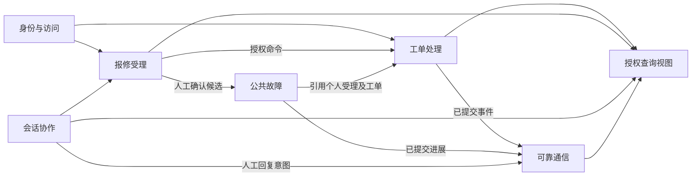
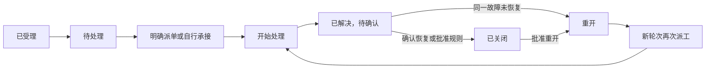

# 医院故障报修平台：领域与分层设计

日期：2026-09-22。状态：PROPOSED，供业务与架构定稿。依据当前仓库及本次用户需求形成；术语见 [CONTEXT.md](../../CONTEXT.md)，现状证据见 [探索记录](exploration.md)。本文的新模块名、命令和事件是目标契约草案，不代表现有 API。

2026-09-22 用户后续明确了按报修来源发送的通知策略，见 [ADR-0023](../../adr/0023_origin_based_notification_routing.md)。该项已作为业务设计决定记录，其余未定细节仍保持提案状态。

## 1. 设计结论与业务主线

继续采用模块化单体，以业务上下文组织模块，每个模块内部区分领域、应用服务和外部适配。企业微信专用基础设施与平台通用基础设施分开。防腐层是外部适配器内部的语义翻译边界，不另造所有请求都必须经过的全局“大层”。

统一业务主线：报修材料先保存 → 服务受理 → 规则优先判定 → 必要时人工复核 → 最小工单及后续完善 → 明确处理责任 → 处置 → 解决 → 报修人反馈/确认 → 关闭；未恢复时重开原工单并再次派工。

“客户对 ticket 处理”在本方案解释为“客服对工单进行调度或自行处理”。“tarui”按 Tauri 桌面壳理解；本次不选择其版本或实施桌面打包。

2026-09-23 关闭及内部接管的后继产品决定见 [ADR-0024](../../adr/0024_staff_completion_and_takeover.md)：处理人填写处理过程后直接关闭，不等待报修人逐单确认；内部同事可相互接管、转派和代办，最后接管者负责。下文动作表中解决后再确认的路径保留为既有模型参考，不再是新工作台默认流程。新命令、授权及反馈契约仍待实施；超时关闭不新增默认启用政策。

## 2. 两个维度：业务上下文与技术分层

业务上下文回答“谁拥有这个事实”，技术分层回答“谁依赖谁”。Bot、H5、桌面不是三个工单领域；数据库、SDK、LLM 也不拥有工单状态。

| 业务上下文 | 独占事实与规则 | 与其他上下文的关系 |
| --- | --- | --- |
| 身份与访问 Identity & Access | 人员、外部身份绑定、认证主体和权限范围；资料来源与历史快照分开 | 向受理/工单/会话提供有来源的身份和授权结果，不替工单决定归属 |
| 报修受理 Intake | Service Intake、Contact Journey、Channel Leg、判定、人工复核、材料补充 | 接入标准化消息或真实网页提交；通过 Ticket Port 建单/关联 |
| 会话协作 Conversation | Thread、Session、沟通责任、接管、控制模式 | 引用受理和工单；一位客服负责沟通不代表负责维修 |
| 工单处理 Ticket | 工单编号、状态、处理组/处理人、动作、处理轮次及事件 | 唯一处理权威；向通知与查询发布已提交事实 |
| 公共故障 Incident | 人工确认的公共故障、报修关联和订阅 | 引用个人受理/工单；不吞并、不自动关闭个人工单 |
| 可靠通信 Communication | 沟通内容、发送意图、投递和尝试 | 根据已批准策略送达；不修改 Ticket 状态 |

第三方人员目录属于身份与访问上下文的外部资料来源。它提供“当前目录快照”和受控人员详情，不创建第二套 Person；报修受理在首次成功解析时写入独立的 `Reporter Profile Snapshot`，后续目录同步不得回写历史工单。

报修人门户和内部工作台是这些上下文的查询与操作界面，不再建立独立的“门户工单”。服务目录/分类属于受理规则支撑；审计、运行监测、配置和投影是支持能力。AI 是受理分析与沟通建议的可选能力，不作为拥有 Ticket 的新核心上下文。未来内网 Integration 仅保留既有边界，不启动 P3。

这些是逻辑边界，当前不拆微服务，也不为了上下文图立即创建六套包或数据库。

## 3. 分层与依赖规则

| 位置 | 职责 | 不应出现 |
| --- | --- | --- |
| 展现层 | Notion 风格工作台、H5、未来桌面壳；表单、导航、授权视图 | Provider 密钥、SQL、状态决定权 |
| 入站适配器 | HTTP/Bot 回调/网页路由，校验协议并调用用例 | 绕过用例更新工单 |
| 应用层 | 用例编排、认证授权、事务、幂等、版本控制、领域调用和提交事件 | 故障规则藏在路由中、直接使用 SDK 报文 |
| 领域层 | 实体、值对象、业务动作与不变量、确定性策略、领域事件 | fetch、SDK、SQL、Cookie、HTTP 状态码、DOM |
| 出站适配器及防腐边界 | Repository、身份目录、Bot、医小修应用发送、LLM 结果转换 | 让外部状态覆盖本地权威、把原始返回值透传领域 |
| 企业微信基础设施 | SDK 包装、HTTP、认证材料、Token 缓存、协议/错误、超时、限流、能力封装 | 派单规则、工单标题策略、谁应收到某种业务通知 |
| 平台通用基础 | 时间、事务机制、日志脱敏、资源限制等真正通用机制 | Bot、Ticket、医小修特定语义 |
| 装配入口 | 配置和实例化各实现，启动 App/Worker/Gateway | 新的业务事实源 |

依赖方向：界面/入站适配器 → 应用用例 → 领域。应用定义其所需 Port，出站适配器实现 Port 并调用企业微信或数据库设施；装配入口注入实现。领域只依赖纯领域类型及必要的稳定值类型，不依赖任何 Provider 或持久化实现。

SDK 升级理想影响面是企业微信 SDK 包装和对应适配器契约测试；Provider 语义改变时，防腐转换也可能需要修改。不能承诺任何 SDK 升级都只改一个文件。

## 4. 企业微信能力的具体边界

### 4.1 一个专用基础设施模块，多个明确适配器

`infrastructure/wecom/`（目标目录）包含：Bot SDK 生命周期、企业应用 HTTP、各身份类型的凭据与 Token、规范化错误、请求期限、并发/速率限制、受控日志、媒体能力。Bot 长连接认证和企业应用 access_token 保留独立策略；不强行统一为同一登录流程。

| 适配器 | 输入/输出的领域友好语义 | 内部防腐转换 |
| --- | --- | --- |
| WeComBotInboundAdapter | 持久化渠道消息、参与者/会话引用 | Frame、消息类型、@、引用、回调标识 → 标准化来源事实 |
| WeComBotDirectReplyAdapter | 私聊回复/引导意图 → 发送结果 | 群内收到 @Bot 后也私聊用户；不承担群内回复 |
| WeComBotDirectNotificationAdapter | Bot 来源的个人状态通知 → 投递结果 | 原报修人身份绑定、Bot 主动私聊能力及消息载荷；可复用现有 Bot Sender |
| WeComMessagePushAdapter | 来源群安全摘要及原报修人强 @ 提醒 → 投递结果 | 企业微信“消息推送”能力；独立于 Bot 回复适配器 |
| WeComAppNotificationAdapter | 应用通知意图 → 投递结果 | 应用收件身份、模板卡片或批准的消息载荷、Provider 回执 |
| WeComMemberIdentityAdapter | 成员认证结果/外部绑定证明 | OAuth 返回、企业/应用范围、官方身份转换 |
| WeComDirectoryAdapter | 有来源的人员资料快照或 DEFERRED | 目录字段、组织、停用状态、缺失/冲突 |
| ThirdPartyStaffDirectoryAdapter | 正式三方目录的组织树同步和人员详情 | `/token/*`、服务商字段、Token、UID Resolver 和协议错误不泄漏到领域 |
| WorkbenchIdentityAdapter | 内部 Principal 与角色范围 | 工作台认证；保持与医小修成员会话隔离 |
| YixiaoxiuWebAdapter | 已认证网页提交/本人查询/补充/反馈命令 | HTTP、Cookie、CSRF、网页 DTO，不伪造 Bot 消息 |

“医小修 H5”既有平台交互（认证）也有平台无关的报修用例，因此不应把整个医小修应用放进 WeCom SDK 包里。可以组合适配器，无须每个适配器建立新进程。

按用户明确的渠道定义：Bot 在群内接收入站 @Bot 消息，向该报修人发起私聊回复；群内出站提醒由独立的“消息推送”功能完成，并强 @ 报修人。不得将消息推送包装成 Bot 群回复，也不得复用群内回调回复作为替代实现。三类出站能力分别为 Bot 私聊、消息推送、医小修应用消息。

### 4.2 稳定契约草案

- `SubmitFaultReport`：已授权报修人引用、来源引用、描述、位置/附件引用、命令标识；返回受理回执、可选工单引用和待办状态。
- `AnalyzeIntake`：受理材料版本、来源事实和规则版本；返回候选分类、缺失项、冲突、出处及复核理由。
- `UnifiedTicketCommandPort` / `QueryPort` / `EventPort`：复用既有长期边界，逐步收窄当前 facade。
- `SendNotification`：投递标识、接收人绑定引用、业务里程碑、模板版本、允许外显字段、详情定位引用；不接收一整张内部 Ticket 或 raw userid。
- `ResolveExternalIdentity`：来源、企业/应用范围及身份引用 → 有依据的内部绑定或明确未解析结果；身份失败不等于允许猜测匹配。

原始 userid、open_userid、chatid、msgid、req_id、response_url、agentid 和模板载荷只能存在于相应外部映射、受限来源存储及适配器中。领域允许持有不透明来源引用和报告时资料快照，不需要理解 Provider 字段。现有 Sender Port 仍含 provider/target_id，是已有基础设施边界；目标是其上方增加业务意图边界，而非声称现状已完全隔离。

不抽象一个无限扩张的 `WeComService.execute(apiName, payload)`。这会把 Provider API 泄漏给所有调用者，也无法区分可重试读取、认证和可能已生效的外发。

## 5. 四条报修路径

| 用户路径 | 既有入口语言 | 统一处理 | 关键约束 |
| --- | --- | --- | --- |
| 群聊 @Bot 并在群内报修 | GROUP_MENTION_INLINE | 群消息 → 受理/Journey → 规则/人工 → Ticket | 群成员与主题隔离；Bot 回复走私聊，群内提醒走消息推送强 @ |
| 直接单聊 Bot 报修 | DIRECT_ORGANIC | 单聊消息 → 受理/Journey → 同一 Ticket 用例 | 同一人可以同时存在多起故障 |
| 医小修 H5 报修 | APP_WEB_SELF_SERVICE / WEB_FORM | Web Submission → 受理/Journey → 同一 Ticket 用例 | PORTAL/YIXIAOXIU_WEB；Bot Inbox、Thread、Session、Direct Leg 可为空 |
| 群聊 @Bot 后转单聊 | GROUP_MENTION_TO_DIRECT_GUIDED | 原群受理 → 验证续接关系 → 增加单聊 Leg → 延续原受理/工单 | 不合并原始 Thread，不凭同一人和相近时间自动关联 |

GROUP_MENTION_INLINE 表示报修材料在群内提交，不表示 Bot 在群内回复。群转单聊路径表示用户继续到单聊补充材料；单凭 Bot 发出私聊回复，不代表用户已完成续接，不得伪造用户单聊入站事实。

四条是业务旅程，传输来源是群聊、单聊、网页三类。第四条不是另一个工单模型。同一受理不因切换渠道重建工单；无可靠关联时要求选择或进入人工复核，新故障明确创建新的受理。

资料补充、目录查询和转单聊失败不撤销已经记录的受理。明确故障先形成最小工单；分类/责任/风险不确定时可同时存在 Manual Review Item。仅有“在吗”“帮忙看看”之类无法确认诉求的材料也要保留，进入澄清或复核，不能捏造故障。

LLM 输出是候选分析。后续获授权时必须经 Schema、出处、风险、人工接管失效保护和应用策略才能转成动作；高置信度不是绕过权限的通行证。当前保持规则+人工主路径及 AI 默认关闭。

## 6. 实体、聚合和值对象

| 概念 | 建模选择 | 一致性与关系 |
| --- | --- | --- |
| Person | 身份上下文的实体/长期聚合根目标 | 独立稳定身份；角色和外部账号不能替代人员；当前不虚构完整人员主档已实现 |
| Principal | 访问上下文中的操作主体 | 与 Person 可关联但不等同；工作人员和成员的权限分别判定 |
| Service Intake | 受理聚合根 | 一次诉求；材料修订与判定依据版本一致；当前同一受理最多关联一张主工单，复杂拆单另立决策 |
| Contact Journey / Channel Leg | 有持续身份的关联实体 | Journey 关联接触段，不承载第二份 Ticket 状态；沿用现有多 Intake 关联可能性，不强改为全局一对一 |
| Manual Review Item | 可独立领取/解决的复核实体 | 解决时验证材料/判定版本，旧审查不能覆盖新补充；可关联已有 Ticket |
| Conversation Thread / Session | 会话身份实体及会话控制一致性边界 | 群 Thread 包含多人多主题，Session 不等于 Ticket |
| Ticket | 核心聚合根 | 状态、当前责任、版本和业务事件在一致事务中改变；历史事件分页访问，不整体加载进实体 |
| Ticket Assignment | Ticket 内的责任关系及变更历史 | 当前责任只有一份；不建立独立可写的镜像派工权威 |
| Resolution Feedback | 目标中的追加式业务记录 | 引用 Ticket 与处理轮次、反馈人及结果；反馈不直接等同状态迁移 |
| Incident | 公共故障聚合根 | 与个人 Intake/Ticket 是关联；单独确认影响与恢复 |
| Communication Message / Delivery | 独立通信事实与每目标投递实体 | 与工单独立演进；发送失败不会回滚已提交派单/解决 |

值对象：TicketId、TicketNumber、PersonId、ReporterRef、SourceRef、FaultDescription、OccurrenceLocation、Priority、AssignmentTarget、ResolutionSummary、FeedbackOutcome、HandlingCycleRef。无身份且不可变的值不必建立单独数据库表。RequestRef、TicketNumber 和通知中的链接都是定位信息，均不能替代授权。

Reporter、Service Agent、Dispatcher、Handler 是角色或关系，不是四份用户表。Person 是人员事实，Principal 是操作授权事实，外部绑定是来源身份事实；三者不应压成一个带大量可空字段的 User。

## 7. 工单动作与状态

保留当前持久状态：NEW、QUEUED、ACCEPTED、IN_PROGRESS、WAITING_REQUESTER、WAITING_VENDOR、RESOLVED、CLOSED、REOPENED、CANCELLED。责任分配与处理状态分开表达；不为派单、转派、通知失败每件事新增状态。

| 动作 | 执行人/条件（目标） | 结果 | 对外策略 |
| --- | --- | --- | --- |
| AssignTicket 派单 | 调度员；QUEUED 或 REOPENED，目标组/人有效 | 明确当前责任；尚未接单可继续待处理状态 | 按来源路由发送“已安排人员处理”通知 |
| AcceptTicket 接单 | 有权限的目标处理人；无分派时可受控自行接单 | 确认承接；首次流程进入 ACCEPTED | 本轮已有派单通知则不重复；自行接单首次建立责任时通知 |
| StartWork 开始处理 | 当前处理人；已接单或合规的重开后承接 | IN_PROGRESS | 默认仅更新页面 |
| TransferAssignment 转派 | 调度员或受限当前处理人；目标有效且范围获准 | 更换责任，保留处理历史；不代替开始/结束 | 默认不额外外发，除非后续业务批准 |
| UnassignTicket 撤销派单 | 调度员；建议限未开始处理的 QUEUED/ACCEPTED/REOPENED | 清除当前个人责任，保留服务归属组，回到待分配；追加原因 | 页面明确待重新安排；是否补发变更通知待定 |
| RequestInformation / WaitVendor | 当前处理人；IN_PROGRESS | 等待报修人/第三方，保留处理责任 | 页面更新；额外提醒策略另定 |
| ResumeWork | 当前处理人；等待状态 | IN_PROGRESS | 页面更新 |
| ResolveTicket 解决 | 当前处理人或获准管理角色；IN_PROGRESS | RESOLVED，记录安全结果摘要 | “已处理完成，请确认恢复” |
| ConfirmResolution 确认恢复 | 原报修人授权范围；RESOLVED | CLOSED，保留确认依据 | 默认不重复发送第二条完工通知 |
| CloseByPolicy 策略关闭 | 已批准的系统规则/管理权限 | CLOSED，独立关闭原因 | 不编造报修人确认 |
| SubmitFeedback 提交反馈 | 原报修人；绑定解决轮次 | 追加已恢复/未恢复/评价记录 | 本身不发送状态通知 |
| ReopenTicket 重开 | 授权报修人策略或客服处理重开申请；RESOLVED/CLOSED | REOPENED，新处理轮次，保留旧解决记录 | 重开申请和重开本身不冒充已再次派工 |
| ReassignAfterReopen 再次派工 | 调度员选择组/人，或合规自行承接 | 新轮次明确处理责任 | 本轮新的“已安排人员处理”通知 |
| CancelTicket 取消工单 | 获准角色及取消原因；遵守现有允许状态 | CANCELLED | 与撤销派单分开呈现 |

当前 facade 不具备表中全部命令；现有 accept/transfer/reopen 不能通过重命名就宣称兼容以上全部行为。特别是 REOPENED 的接单、重新分派和撤销已接单动作，必须补充转换规则与契约测试。

进行中撤销派单不直接开放：默认要求显式转派或“停止处理并退回调度”后继用例，以记录未完工作和责任交接。旧处理人可作为历史参考保留，重开后是否继续负责必须显式确认；实现时不得仅凭旧 assignee_id 绕过再次派工。

这是业务流程图，不是替换现有状态机的可执行契约。WAITING、转派和取消规则见动作表。

## 8. 通知是一条独立可靠链

业务事件 → 通知策略 → 安全消息模型 → Communication Message / Outbox → Delivery → 指定发送适配器 → 结果与核对。

### 8.1 按原始报修来源路由（用户已明确）

| 原始报修路径 | 必需的状态通知路径 |
| --- | --- |
| 直接单聊 Bot | Bot 私聊原报修人 |
| 医小修 H5 网页报修 | 医小修企业应用向原报修人发送模板状态消息 |
| 群聊 @Bot 并在群内报修 | 企业微信“消息推送”到来源群并强 @ 原报修人，同时 Bot 私聊原报修人 |
| 群聊 @Bot 后转单聊报修 | 保留群聊原始来源：消息推送在来源群强 @ 原报修人，同时 Bot 私聊原报修人 |

来源绑定包含原始来源类别、来源账号/应用范围、来源群引用（适用时）及原报修人绑定。后续在 H5 查看 Bot 工单、在单聊补充群内报修，不改变通知路由。域内持有不透明引用，Provider 原始标识由适配器解析。

“同时”表示同一业务通知节点规划两路独立投递，不要求两个外部请求同一瞬间成功。群内投递与私聊分别去重、记录结果和恢复；其中一路失败不能使另一路重复发送，也不能把整体标记为全部成功。群不可达或用户不再在群内时，保留群路由失败/不可达事实，私聊继续按其权限和能力投递；不改发任意其他群或擅自切换医小修应用。

群内只发送批准的低敏感状态摘要并 @ 原报修人，不带完整故障描述、补充信息、内部备注或私人详情。个人进展在私聊/应用消息及经授权的详情页提供。群消息、Bot 私聊和应用消息可使用不同呈现载荷，共享同一业务里程碑。

### 8.2 通知节点、去重和投递结果

默认目标里程碑：首次明确处理责任、每轮技术解决、重开后再次明确处理责任。关键是“每轮”，不能按 Ticket 永久只发送一次，也不能每次重试生成一条新通知。

建议每路投递唯一身份包含 `ticket + handling_cycle + milestone + reporter_binding + route_kind + destination_binding`；destination_binding 包含来源账号/应用范围及目标群或个人的受限绑定引用。群和私聊是两路不同投递；以实际源事件和内容摘要绑定。模板版本记录到意图，不通过升级模板绕过去重。人工重发必须是独立授权命令并可追踪，不能伪造新业务事件。

- 已提交工单事实必须能恢复生成待发意图：与事件同事务提交 Outbox，或采用现有持久化事件+幂等投影及检查点恢复；不要求为此引入消息中间件。
- 发送结果保持 ACKNOWLEDGED / REJECTED_NOT_APPLIED / UNKNOWN。UNKNOWN 不做无条件自动重发，进入核对或有据重试；不承诺跨网络“恰好一次送达”。
- 任一路通知失败时工单照常处理，H5 可查进展，内部工作台按路由显示待发/失败/待核对；不可把失败写成已读。
- 模板只包含批准的工单编号、外显状态、简短结果及本人详情入口。内部备注、原始身份、内部责任人标识不进入模板。
- 点开卡片后重新认证及核验本人归属；定位引用、OAuth 成员认证和工单授权是三件事。
- Bot 即时回执/续接引导、按来源路由的工单状态通知、公共故障摘要分别定义策略；来源群通知不要求该工单属于 Incident。

按来源路由的业务决定已记录于 ADR-0023：Bot 来源沿用 Bot 私聊方向，只有 H5 来源要求医小修应用通知；群来源在个人通知之外增加群 @ 路径。该后继设计明确调整旧群通知策略和网页 APP_ONLY 的目标行为；已有运行模式在实现任务完成前仍保持原约束。实施时同步改相关契约与基线描述，保留 OAuth-only/readonly/受限测试的零外发边界。

具体企业微信消息类型、应用权限和真实送达能力须在实施任务中依据当时官方文档与受控证据验证。本次未联网查询 API，不能把“模板消息”的产品用词当作 API 能力验证。

采用企业微信“消息推送”实现来源群强 @ 是用户已明确的设计输入。本次未执行项目接入或现场效果测试；后续应验证消息推送确实强 @ 指定报修人，普通文本“@姓名”或普通消息成功回执不能替代验收。Bot 群内回复不再是候选方案。

## 9. 双端体验与安全投影

### 内部 Web 工作台与未来 Windows 壳

同一套 Web 工作台服务客服、调度员、处理人和管理员；按权限展示操作。目标采用 Notion 式侧栏、简洁列表/表格、详情主区和活动记录，避免把聊天界面变成唯一入口。

核心导航：工作台首页、会话收件箱、人工复核、工单、公共故障、通知异常、配置。详情中明确分开展示报修内容、处理责任、沟通责任、进展、内部备注和报修人可见结果；“会话待办”和“工单待办”不能混为同一种未读。

Tauri 是后续宿主，只通过服务器授权 API 获取数据，不嵌入 WeCom 密钥或直接写数据库；原生窗口和通知能力属于可替换宿主边界。桌面登录、Cookie/跳转、更新、存储策略及失联表现需独立设计验证，本次不承诺浏览器代码原样打包即可完成。业务规则仍在服务器，离线写入不在当前范围。

### 医小修 H5

导航围绕“我要报修、我的报修、详情与补充、处理结果反馈”。未建单的受理也必须出现在“我的报修”，清楚显示待补充/待复核，不因没有 Ticket 而消失。

H5 不镜像全部内部工作台功能。两端共享用例语义、状态用语与服务器事实；DTO 按受众裁剪。后台服务端过滤本人、企业/应用范围和保留期，内部备注在查询中就被排除，不能靠前端隐藏。

H5 完工反馈须独立于 supplement：RESOLVED 下确认恢复或提交未恢复；CLOSED 下评价或申请重开；新无关故障引导新报修。现有终态补充限制保持，直到新的反馈契约完成。

## 10. 边界压力场景

| 场景 | 应有结果 |
| --- | --- |
| 同一人两分钟内报打印机与处方系统两个问题 | 两个受理；不能按时间窗口并单 |
| 群聊报修后点续接到单聊 | 验证关联，延续原受理/工单；保留两个 Thread |
| 多个群成员同时 @Bot 描述相似问题 | 每人受理独立；公共故障需人工确认 |
| 网页提交超时后重试/刷新 | 原命令回执恢复；不得重复受理/建单 |
| 目录查不到姓名，故障清楚 | 保存受理和最小工单，资料待解析 |
| 明确故障但分类置信度不足 | 最小工单+复核，不因为模型不确定漏单 |
| 模型不可用 | 规则与人工路径完整运行 |
| 客服正在沟通，工程师处理 | 两份责任分别变化，不互相覆盖 |
| 两名客服同时派单 | 版本/幂等保证一次有效责任变化，失败方刷新 |
| 已派单通知后撤销分派 | 工单继续存在，显示待重新安排；不错误标为已取消 |
| 工程师完工，同时报修人补充“仍不行” | 以版本冲突/明确反馈判定，不能丢材料或静默确认恢复 |
| 已关闭后未恢复反馈 | 追加反馈，按明确权限重开；再次派工产生新轮次通知 |
| 补充到来时客服正在处理旧复核 | 拒绝过期材料依据，刷新后复核 |
| 企业微信接受请求但客户端丢回执 | UNKNOWN 待核对；不自动改新 ID 重发 |
| A 转发工单通知链接给 B | B 不能读 A 的工单；链接不授予权限 |
| 群内状态推送成功、Bot 私聊失败 | 分别记账并恢复私聊；不重发已成功的群消息 |
| 群转单聊后又在 H5 查看进展 | 仍按来源群 @ 加 Bot 私聊；不因页面访问新增应用通知 |
| 医小修 OAuth 成员也是医院工程师 | 仍需独立工作台权限，不能复用成员 Cookie 越权 |
| 公共故障恢复但某报修人仍不正常 | 保留个人工单继续处理，不随 Incident 自动关闭 |

## 11. 渐进落地与验证

目标目录示意：`src/modules/{intake,ticket,conversation,incident,communication,identity}/` 内按需要放 `domain/`、`application/`、`adapters/`；`src/infrastructure/wecom/` 隔离 Provider；`src/platform/` 放通用设施；`src/bootstrap/` 负责装配；`web/` 保留两个受众入口。不为每个模块预建空目录，不把阶段文件一次性移动。

| 增量 | 输出/依赖 | 应验证的具体风险 |
| --- | --- | --- |
| D0 业务契约定稿 | 关闭/反馈/重开、撤销派单、通知决策；必要的后继 ADR | 与 V1.4/ADR-0017/0021 冲突先解决，保留运行授权边界 |
| D1 提取企业微信基础边界 | 复用现有 Gateway/Token/HTTP/身份映射，以窄接口包装 | Bot 与应用凭据不混用；超时未知结果不重复发送；SDK 契约不泄漏 |
| D2 工单责任动作 | 明确 assign/unassign/重开再派工契约；复用单一 Ticket Core | 并发派单、撤销范围、旧责任阻止误接单、事件/责任原子性 |
| D3 按来源通知 | 来源路由策略、Bot 私聊/消息推送/医小修应用适配器，复用 Outbox/Delivery | 双路独立结果与恢复、真实群 @、每轮去重、响应丢失、已提交事件恢复、受限模式不意外外发 |
| D4 H5 反馈闭环 | Feedback/confirm/reopen 的本人命令和安全查询 | 跨成员拒绝、旧轮次反馈、补充竞争、终态与原 ID 重放 |
| D5 工作台体验 | Notion 风格信息架构与交互；共享事实和契约 | 双责任可区分、操作可恢复、外显/内部信息隔离、浏览器验收 |
| D6 Windows 宿主 | Tauri 封装与身份/升级/原生能力边界 | 不持有 Provider 密钥、登录回调与失效、真实桌面验收 |

这只是后续拆任务顺序，不新增已授权运行任务。每个增量都要有输入输出、契约、数据库变更或明确无变更、资源预算、默认关闭方式、Unit/Contract/Integration 及适用浏览器验证、证据、回退方式与 backlog 状态。仅在具体能力需要时引入前向迁移，不重写旧迁移、复制 Ticket 表或重绑历史 tested_head。P2-007 正式三方人员目录 Provider 的独立实现和 migration 036 受 [ADR-0025](../../adr/0025_third_party_staff_directory_provider.md) 约束，默认关闭，不改变本阶段 Gate。

同机约束继续为一个 App/API/SSE、一个 Worker、一个活动 Gateway、一个 PostgreSQL；AI/Communication/Integration 并发各 1，SSE 默认 32，连接池总量建议不超过 8。新增领域边界不增加常驻进程。

本文件的总体设计仍不等同于生产运行或 Gate 验收。P2-007 Provider 增量另有正式接口文档、前向迁移、默认关闭的运行时装配和独立测试；它不扩大 P2-G2-LIVE、P2-008 或生产上线授权。
