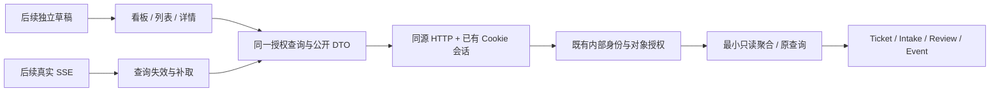

# 正式管理端技术方案（WEB01–WEB05）

状态：技术选型已由用户确认；实现与运行验证以 WEB01 PR 实际结果为准。日期：2026-10-07。

基线：最新远端 main `1948f76a676f9bfd7ebcbecd3af7951da4034e7e`（PR54 merge）。用户本轮要求交付 WEB01 真 HTTP 只读页面；本文件随业务实现 PR 交付，不单独建立盘点 PR，也不批准 WEB02、部署或现场运行。原 181 项迁移、D01/R01 与既有证据保持原对象身份。

## 1. 已决定与待确认

既有[产品设计](admin-workbench-design.md)、[原型](../../web/admin-workbench-prototype/README.md)、ADR-0024 及本轮请求已决定：Notion 风格、原型 A 三列看板、列表与右侧详情；React/Vite/HeroUI 继续使用；旧管理端和成员端保留；正式包新增在 `web/admin-workbench/`，同源入口采用 `/workbench/app/`。WEB01 只读，使用全新合成开发数据及真实数据库/HTTP 服务。

用户于本轮确认新增 React Router 7、TanStack Query 5、Zustand、TanStack Table 与 Tailwind；首版以 Edge/Chrome 为基线，并追加 Morphicons 图标微动效。后续编辑草稿的刷新恢复偏好留待 WEB02；WEB01 只读，不引入敏感草稿持久化。这些确认允许继续 WEB01，不批准后续阶段或现场行为。

包管理器兼容声明只用于筛选依赖，构建与浏览器兼容性仍需实际验证。

## 2. 技术栈与版本

| 层 | 选型 | 本轮策略 |
|---|---|---|
| 前端组件运行时 | React / React DOM 19.3.0 | 复用原型锁文件，独立正式包 |
| 组件与样式 | HeroUI React/styles 3.2.6；Tailwind/Vite plugin 4.3.3 | 提取原型布局、颜色、紧凑排版；用组件语义和键盘能力，不照搬演示状态 |
| 图标 | lucide-react / lucide 1.47.0 + Morphicons 1.7.1 | 静态组件与同版本图标数据共存；只在侧栏/视图切换用微动效，reducedMotion="user"；MIT 许可 |
| 构建 | Vite 8.3.0；React plugin 6.1.1 | 生产静态构建、hash 文件、manifest；现有 Node HTTP server 服务 |
| 前端类型 | TypeScript 7.0.2；React/DOM types 19.3.0 | Bundler/JSX 配置独立；strict、noUncheckedIndexedAccess、exactOptionalPropertyTypes、useUnknownInCatchVariables |
| 路由 | React Router 7.18.4，声明式模式 | npm 官方元数据要求 Node >=20、React/DOM >=18；不启用其 SSR/framework 构建链 |
| 服务端状态 | TanStack React Query 5.104.1 | npm 官方元数据支持 React 18/19；只负责远端查询、分页与失效，不拥有 Ticket 状态 |
| 临时界面状态 | Zustand 5.0.15 + React 受控字段 | Zustand 只保存共享 UI 状态；URL 保存导航/过滤。未来草稿与查询独立，不复制 Ticket/身份/凭据 |
| 动效 | Motion 13.4.1 | 复用，尊重减少动效偏好；不宣称性能验收通过 |
| 拖动 | @dnd-kit/react 0.5.0 | 保留技术选型，WEB04 合法命令接入时使用；WEB01 不提供拖动写状态 |
| 表单 | React 受控表单、原生字段和 HeroUI | WEB02 再加入实际表单；本轮不预装表单引擎。草稿/命令版本/服务端错误的边界现在确定 |
| 列表 | TanStack Table 9.2.6 + 语义 table + 服务端分页 | 使用稳定 v9 useTable/最小 features；沿服务器顺序与 cursor，不用客户端表格处理假装全局查询 |
| DTO 与校验 | `contracts/` 公开声明、独立纯解码函数 | JSON 从 unknown 校验；前端禁止 import 服务端数据库、Secret 或运行时模块 |
| 后端 | 现有 Node.js 24、TypeScript 5.9.3 strict、ESM | 新源码 .mts，运行导入/产物 .mjs；不统一前后端编译器、不改成 BFF/Next.js |
| 数据库 | 现有 PostgreSQL；开发测试使用任务自有 loopback PG18 | 复用 Ticket/Intake/Review/Event 等事实；本轮无 schema migration、ORM 或新事实表 |
| 认证/授权 | 现有 Cookie/session、Workbench Authorization | bootstrap 从数据库解析内部 principal；逐请求授权；不虚构 ADMIN、不接真实 OAuth |
| 实时更新 | 现有 SSE，后续接查询失效与补取 | WEB01 不伪装“实时”；WEB04 不另建一套前端事件事实源 |
| 通信/附件 | 既有 Outbox/Delivery、StoragePort 与受控媒体入口 | WEB01 不发送、不引入浏览器直连 SDK 或公开文件桶 |
| 检查与 CI | 现有 Node test runner、PG fixture、浏览器 harness、types-migration workflow | 保持 ACTIVE_SELECTION: v3-p09；增加直接前端类型/构建与相关路由测试 |
| 桌面宿主 | 后续 Tauri 2 / Windows WebView2 | 复用同一 Web 业务边界；宿主登录、通知与升级另行授权设计，本轮不实现 |

正式包声明精确版本，由根 package-lock 统一安装开发依赖到根 node_modules。前端编译器使用 typescript-web 别名（TS7），后端 typescript 仍为 TS5.9；构建验证声明、锁文件安装和实际包版本一致。不把 vendor 或生成 dist 放进 web 源候选目录，不改变既有 G2 指纹算法、文件上限或旧证据。原型锁文件保持。

新增 Router/Query/Zustand/Table/Morphicons 的精确版本于 2026-10-07 从 npm 元数据核验，已安装并锁定；若安装、类型或组件集成出现真实兼容问题，只处理直接阻断，不借机升级原型主版本。

## 3. 模块与数据边界

正式前端保持少量模块：`app/`（外壳、路由、身份生命周期）、`api/`（HTTP、DTO 解码、query keys）、当前 `app/App.tsx`（看板、列表、详情），业务复杂后再沿这些界限拆分。后续会话、公共故障、通知异常按业务工作区添加并懒加载，不建立插件框架。

看板与列表读取同一份已授权事实和过滤状态。URL 保存视图、关闭时间范围及选中对象，支持分享、后退和刷新；游标与每列载入范围明确展示。对象用 `kind + id` 标识，不用标题、姓名或手机号猜测同一业务。打开详情不领取、不改变已读/跟进事实、不锁单。

远端数据不复制到可 mutate 的组件 state。后续写动作一次调用真实授权 command API，保留 expected version、command id 和真实结果；成功后使查询失效。接管与关闭需要服务端原子用例，不能在浏览器串联 accept/start 或 resolve/confirm。

## 4. HTTP、会话与错误

原 `/api/lifecycle/bootstrap` 返回 principal_id、display_name、roles、csrf_token 和 polling_interval_ms。WEB01 按真实返回值建模，不声称旧 lifecycle bootstrap 已有完整 capability DTO。列表与详情继续执行现有对象授权；ADMIN/DISPATCHER 与 HANDLER 的当前可读范围不同，ADR-0024 的未来目标不扩权。

请求仅调用同源、明确列出的 HTTP 路径，Cookie 由浏览器管理，不复制 OAuth/会话凭据到 UI 持久存储或日志。未知 JSON、HTML 响应、错误码及格式不符在 API 层拒绝，不回退 seed。取消过期请求并按对象/过滤条件区分请求身份，旧详情不得覆盖新选择。

采用 Query 时按内部身份生命周期隔离 QueryClient/key；401 或当前对象 403 后停止展示相关授权数据，取消相关请求并清理其缓存。整会话失效/退出清除会话缓存；后续正常局部权限拒绝不误清其他独立获权对象。关闭自动失败重试，不通过隐式重复请求隐藏错误；聚焦/重连刷新显式配置，不让后台刷新抢滚动或覆盖草稿。

分别呈现初次加载、确定为空、过滤无结果、未加载下一页、API 错误、会话过期、无权限、对象不可见/404、离线与旧数据提示。`navigator.onLine` 只作网络线索；不把在线标志当成 API 已连通，更不伪称 SSE 已连接。

## 5. 只读聚合与分页

已新增一个经过现有认证链的有界看板查询，path/DTO 与 WEB01 实现一同固定，`GET /api/workbench/board`；详情为 `GET /api/workbench/items/{kind}/{id}`。本轮新增只读能力。每列单独 keyset cursor，默认每列 50、上限 100；查询先授权、稳定排序、服务端去重，再 LIMIT。不按卡片扇出多次详情查询，不把当前页过滤称全局搜索，不把已加载数量称全量总数。

待复核有真实 Ticket 关联时仅以 Ticket 为主卡，附该身份可见的复核提示；只有未建单项才使用独立 Review/Intake 标识。复核数据本身按既有权限读取，不借 Ticket 卡扩大 Manual Review 权限。普通 RECEIVED/WAITING_DESCRIPTION/WAITING_TRIAGE/FAILED 受理可能尚无 Ticket 或 Review，使用 kind=intake，并沿既有未建单队列的 ADMIN/DISPATCHER 范围读取；不推定 HANDLER 获权。没有优先级事实时返回 null，FAILED 保留失败含义。

三列是展示归组，保留原状态。NEW/QUEUED/ACCEPTED/REOPENED 属待受理；IN_PROGRESS/WAITING_REQUESTER/WAITING_VENDOR 属处理中；CLOSED 进入已关闭。RESOLVED 如放在第三列，必须标“已解决待确认”，且不能因两日关闭窗口隐藏仍未完结事项。CANCELLED 默认从主看板移出，以 range=cancelled 专项筛选查看，保留原状态文字。关闭列按真实完结事件倒序；无完结时间的项排在有时间的项之后，不用 updated_at 冒充完结时间。

已关闭默认以 Asia/Shanghai 自然日今天、昨天过滤真实关闭事件时间；没有 closing event 的记录不得拿 updated_at 冒充关闭时间。业务 LocalDateTime 是 `YYYY-MM-DD HH:mm:ss` 字符串，物理 epoch DTO 保留十进制字符串；不能依赖浏览器本地时区解析无 offset 字符串。时间范围由服务端给出，客户端只呈现。

当前 mine 只有 assignee，WEB01 不提供冒充“处理/沟通/明确关注”的完整“与我有关”。缺失持久关注、presence、SLA、未读、预约跟进时不填假值。全局搜索及后续完整范围查询沿同一服务器投影契约扩展。

同时未完成事项的最大数量尚未知。服务端分页与有界 DOM 作为当前结构，不从每日 <100、同时在线 <=10 推定总积压量。WEB01 对真实合成分页进行验证；虚拟化、索引变更或性能目标须有实际负载问题/验收需求再加入，不预先声称容量证明。

## 6. 静态接入、安全头与制品

生产构建通过现有 Node HTTP/static 扩展服务；Vite dev 仅用于开发，截图及真实接入验收使用生产 bundle 加真实 HTTP。应用壳 fallback 只覆盖 `/workbench/app/` 中已支持的 UI 路径，未知 `/api/` 维持 JSON 错误；新路径接现有页面认证/授权入口，避免静态壳成为绕过认证的新入口。

hash JS/CSS 与 manifest 加入现有构建输入、资源清单、hash proof、verify-artifact。源输入包含正式包与 lockfile；生成 dist 不能成为源候选身份的循环输入。失败构建不留可用旧制品，运行树资源缺失不回退源码或 Vite 服务。仅服务已构建清单中的文件，拒绝路径穿越、未知资产和源码文件。

保留同源/Cookie/CSRF/CSP 边界。Motion/拖动所需样式是否受现有 CSP 限制必须实际验证；如出现直接阻断，提出且测试最小资源策略差异，不关闭安全头或开放任意 origin。无需读取现场 Nginx 或 Secret。

## 7. 后续切片怎样沿用

| 切片 | 接入点 | 本轮只确定的边界 |
|---|---|---|
| WEB01 | 外壳、授权 board/list/detail、静态制品 | 无写操作、无假成功；真 HTTP + 新合成 PG 数据 |
| WEB02 | 明确 command API、原子事务、版本冲突、独立草稿 | 命令结果是事实；内部过程与对外摘要分开，通知走 Outbox |
| WEB03 | 代录字段/已核实身份选择、本人反馈 | 代录人不是报修人；目录失效保留手填、不能猜测通知对象 |
| WEB04 | 现有 SSE adapter → query invalidation；独立未读/跟进/活动 | presence 不是 assignee/SSE 心跳；声音和多标签去重基于真实事件 |
| WEB05 | 同一壳和 Router 下新增工作区，按需加载 | 各域继续独立授权；通知异常权限不由工单权限推出 |

WEB01 已实际使用 TanStack Table；后续表单、全文搜索、虚拟列表、presence、Tauri 或新发布平台没有预装。它们的适配位置已明确，加入真实功能时不需要推倒壳、HTTP、身份、查询和命令边界。

## 8. 本轮可检验结果

实际类型检查、前端生产构建；小型 DTO/状态/时间映射测试；现有隔离 PostgreSQL fixture 上的真实 HTTP/对象授权/分页/去重；少量实际浏览器场景覆盖看板→详情→返回/刷新、401/403/404/离线与主画幅/窄窗口。原型与新页面使用同一合成场景截图对照。

新 WEB01 三个测试同时登记 current 执行计划，保留原 217 项及独立 historical 项；只验证计划可解析，不执行 full/certify、不改旧完成证据。CI 保持 `v3-p09` 可解析，新增前端安装/类型/构建与直接检查，必要后端/浏览器入口走现有 routing；制品与自有服务/浏览器/连接清理沿旧规则。普通 WEB01 不运行 standalone full/certify。全部检查、真实 API、截图与资源关闭只有实际执行后才能在交接中记为通过。

前端延续原型的 `skipLibCheck=true`：锁定 HeroUI 3.2.6 / react-aria 的 vendor 声明在更严格可选字段下存在重复继承冲突，原型本就使用该例外。所有正式 TS/TSX 实现执行 strict 与新增严格选项；项目公开 DTO 另受根严格 type program 检查，其 skipLibCheck 仍为 false。不升级 vendor、不添加 any 或压制正式源代码错误。

## 9. 官方依据

- [Vite Backend Integration](https://vite.dev/guide/backend-integration)：manifest 与现有后端服务 hash 资源。
- [React Router 声明式模式](https://reactrouter.com/start/declarative/installation)：在现有 React/Vite 应用内使用路径路由。
- [TanStack Query 默认行为](https://tanstack.com/query/latest/docs/framework/react/guides/important-defaults)、[请求取消](https://tanstack.com/query/latest/docs/framework/react/guides/query-cancellation)：显式配置重试/刷新，并消费 AbortSignal。
- 原型 package.json/package-lock、正式 package.json、根 package.json/package-lock、现有 P2-016 HTTP/Query/Runtime、公开 contracts 是本项目实际版本与 API 依据。Context7 只用于核对官方用法，不替代本项目锁文件与直接验证。

- [Morphicons 官方用法与减少动效](https://github.com/guillermolg00/morphicons#reduced-motion-all-five-bindings)：使用 Lucide 数据而非 lucide-react 组件；明确启用 reducedMotion=user。
- [TanStack Table v9 Quick Start](https://github.com/TanStack/table/blob/main/docs/framework/react/quick-start.md)、[Zustand create](https://github.com/pmndrs/zustand/blob/main/docs/apis/create.md)：最小 tableFeatures、类型化局部 UI store。
