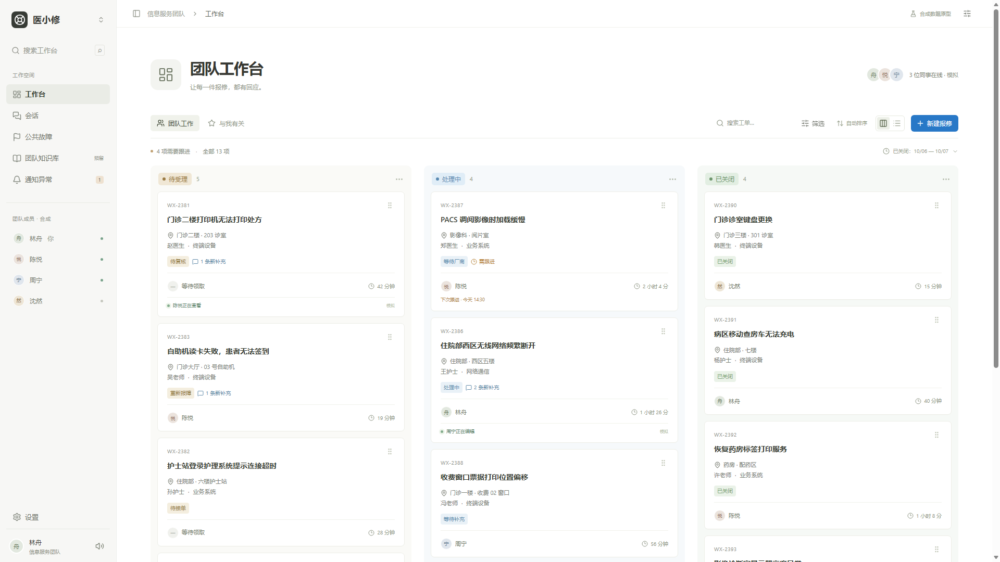
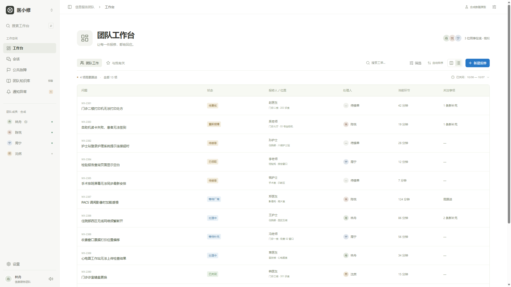
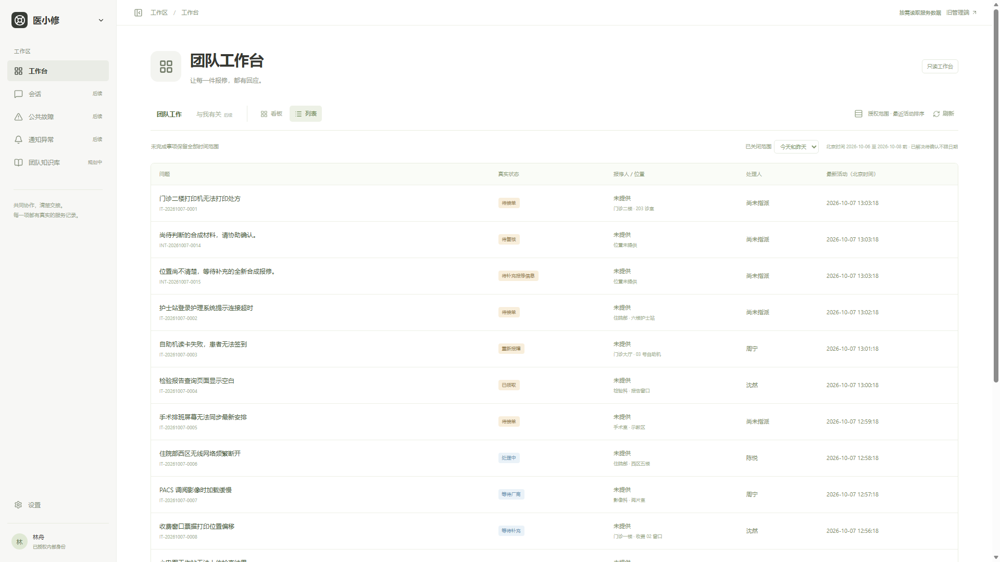
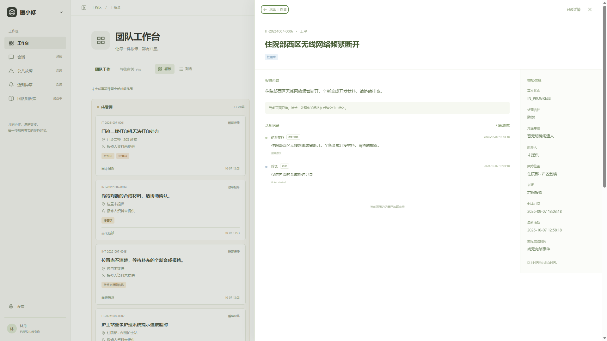
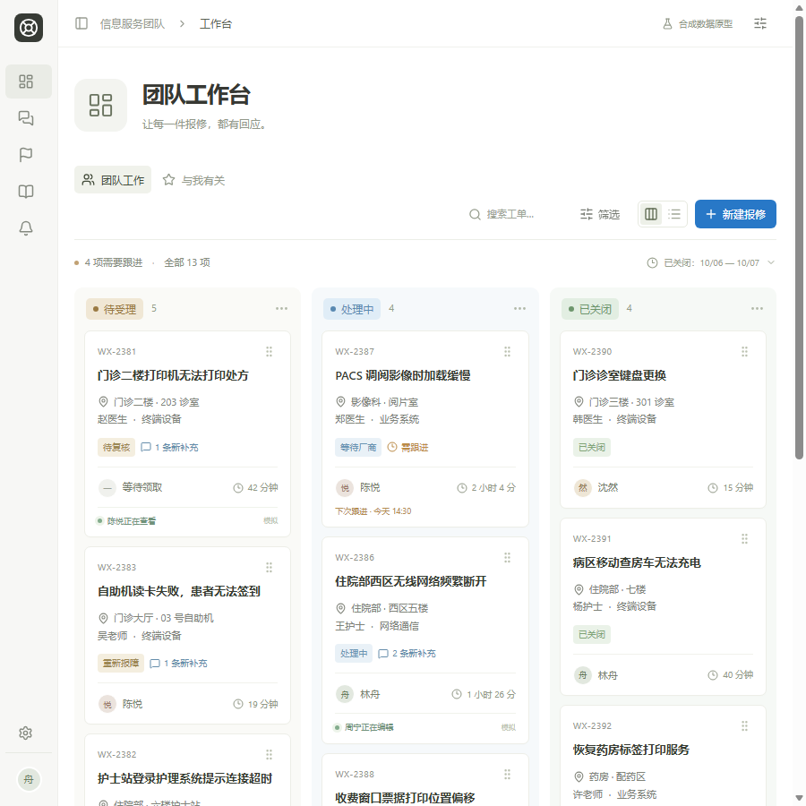
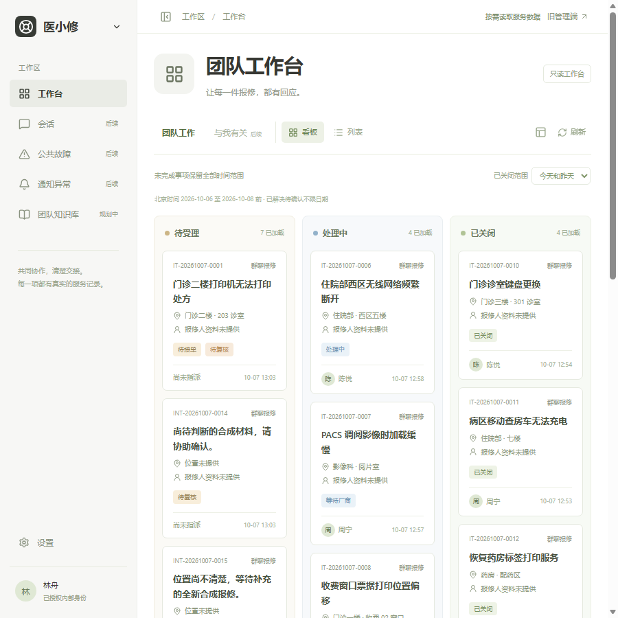
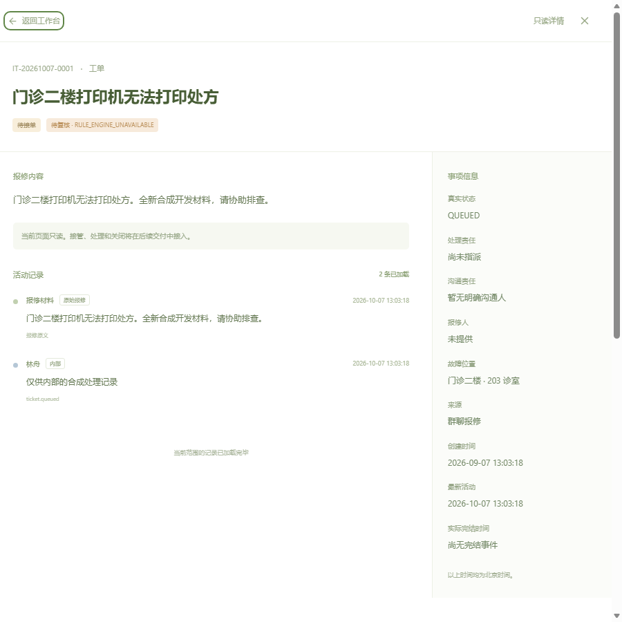
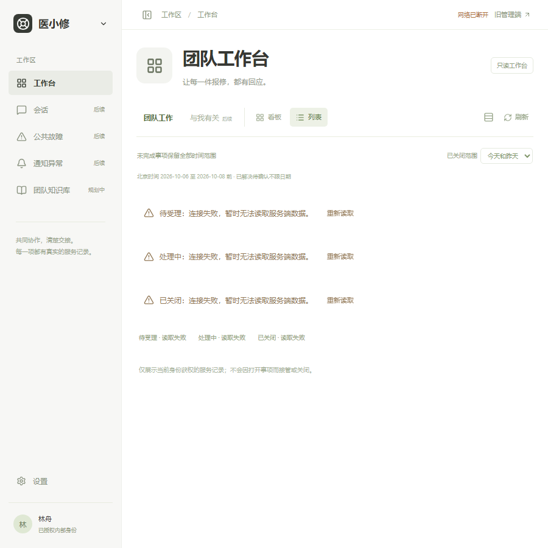

# WEB01 原型与正式页面对照

2026-10-07。原型源为 PR54 main，原型 A/B 生产构建保留；新页面源为 `a964ff9007a76fff57fa20397ab0a2fa4ce3e3b0` 的正式生产 bundle。截图原始 PNG 的尺寸、SHA-256 与源码对象见 [screenshots.json](screenshots.json)。后继截图文档提交不改变实现。

原型 13 个场景与正式开发库的 13 个共同场景使用同样标题/位置；正式库另有两个未建单边界场景，所以看板为 7/4/4，共 15 项。原型姓名、在线提示、时长与动作是内存演示；新页面只有数据库中实际获权字段，没有报修人资料时明确显示未提供。编号、排序和日期来自真实事实，不照搬演示值。

## 1920 × 1080 三列看板

原型：

正式页面（全新合成 PostgreSQL → 实际 loopback HTTP → 正式 React bundle）：

## 1920 × 1080 列表与详情

## 900 × 900 窄窗口

## 实际接入记录与边界

- 使用任务自有 PG18、独立合成数据库、既有内部 test-auth、真实 Node HTTP 和生产静态 bundle；原型不接业务 API。没有真实 OAuth、医院数据库、现场档案、Gateway 或真实发送。
- API 验证实际完成：bootstrap；三列 scope/pagination；Ticket/Review 关联去重；普通 WAITING_DESCRIPTION；真实关闭事件的两日窗口与 range=all；旧非终态和 RESOLVED 保留；原文、内部记录及责任；匿名401、对象越权404、空获权范围；未知 API/资产/source 404；旧入口保留；停用 principal 后壳/API拒绝。
- Edge 154.0.4258.53 与 Chrome 154.0.8037.58 分别执行 WEB01 看板→详情→返回/刷新、列表刷新、窄窗、断线、对象拒绝和会话失效场景。截图取自 Edge；不据此声称其他浏览器或正式性能验收完成。
- 正式源代码 strict 和根类型检查、Vite 构建、源输入/bundle/manifest hash 验证实际通过；保留原型 vendor skipLibCheck 例外，所有正式 TS/TSX 均进入真实编译器。
- 原 `v3-p09` 七项保留，新 WEB01/直接授权入口进入现有 ordinary PR checks；current 计划新增三个测试而不重跑 full/certify。整个 PR 的 exact-head CI/独立审查结果以 PR 正文为准。开发过程的安装布局失败和旧 HTTP/浏览器清理失败日志保留在任务临时报告中，未改写历史 Evidence 或把诊断运行当认证。

这是正式产品的只读首切片。写命令、协作、代录和后续工作区的规划见[技术方案](../admin-workbench-architecture.md)，本轮停在 WEB01 PR，不自动合并、部署或进入 WEB02。
