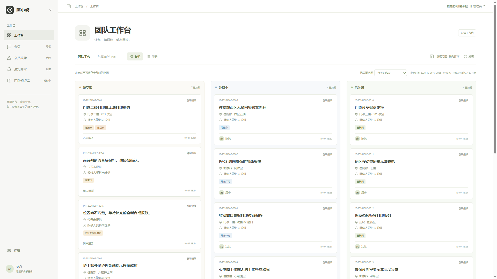
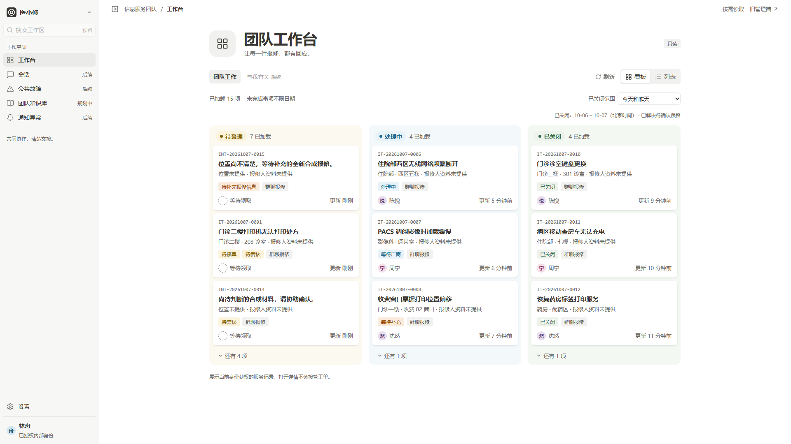
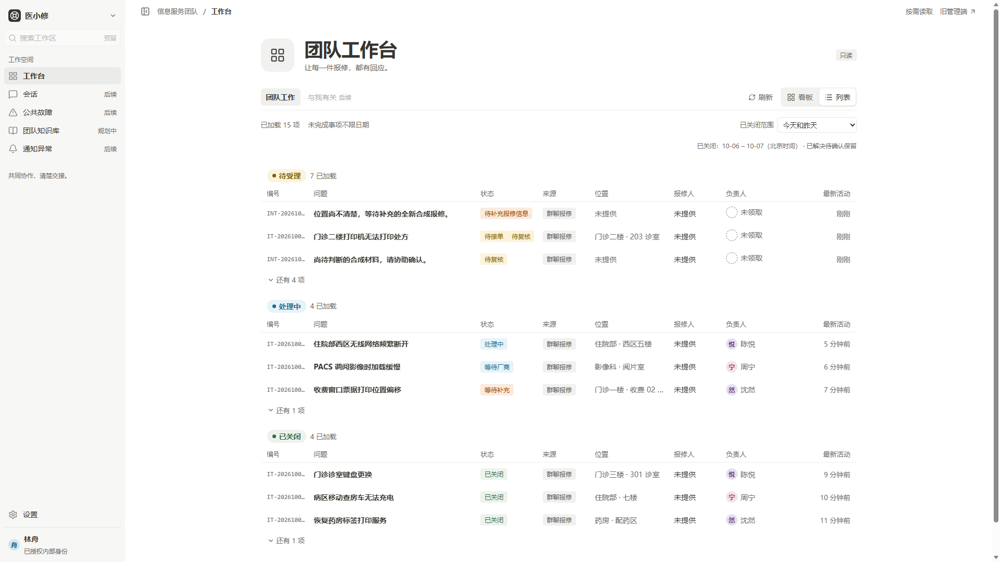
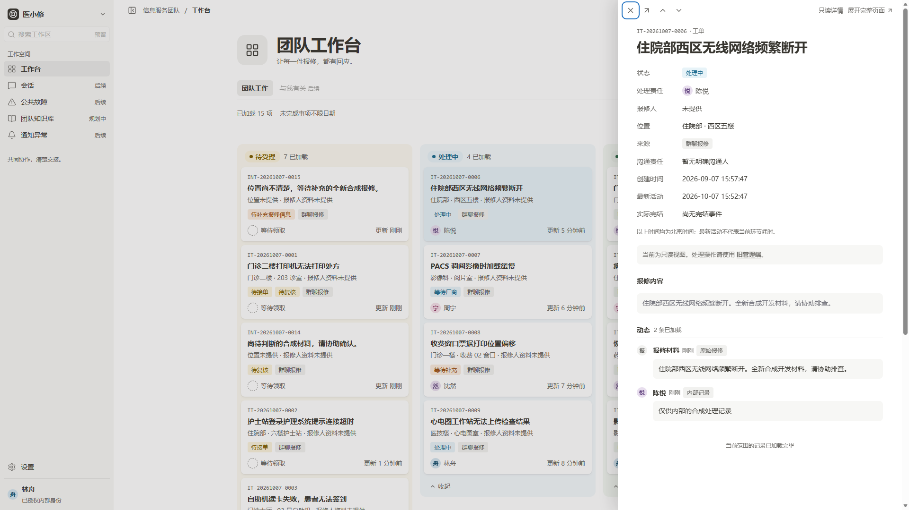
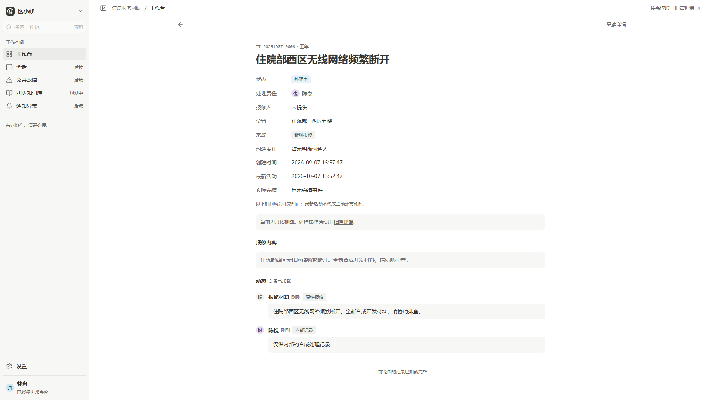
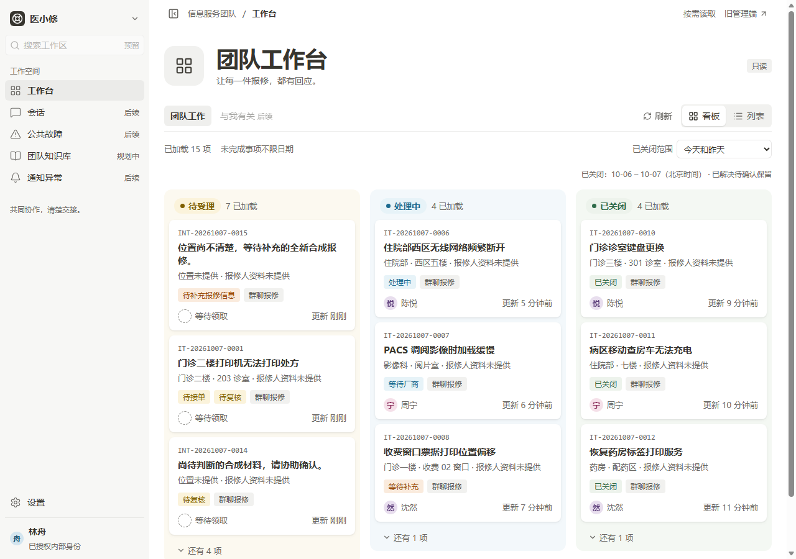
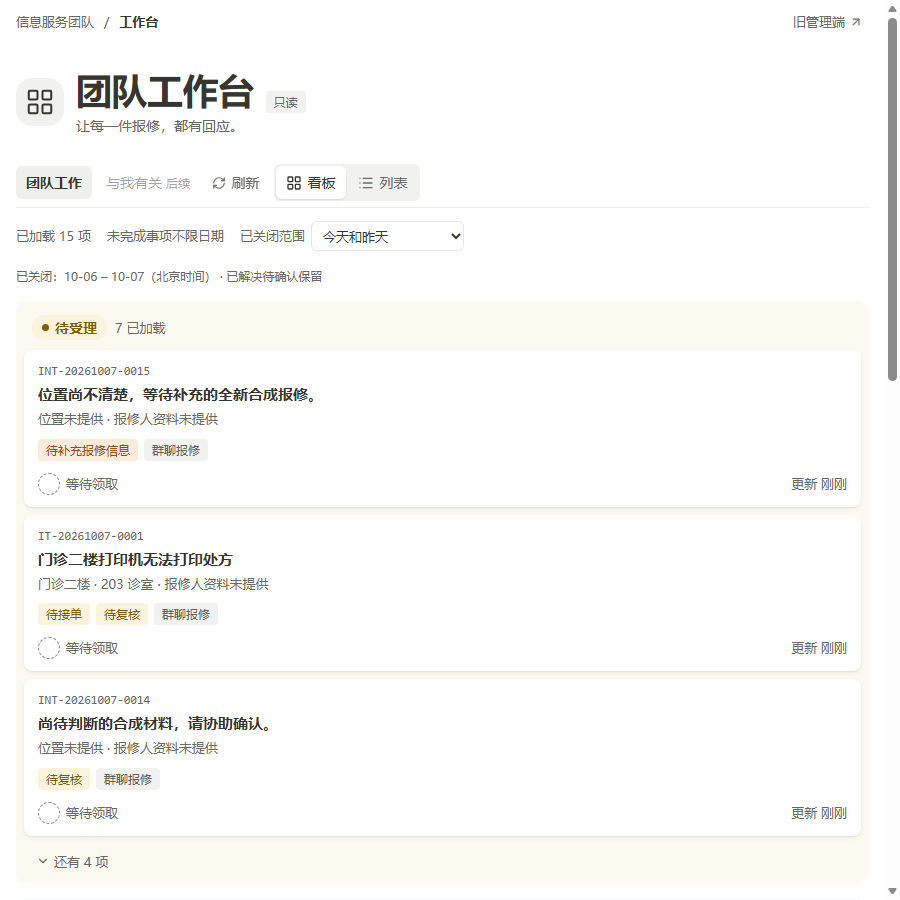
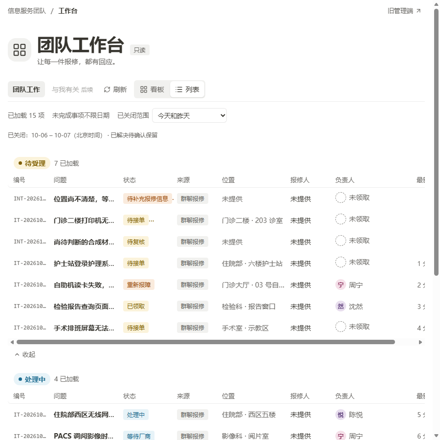
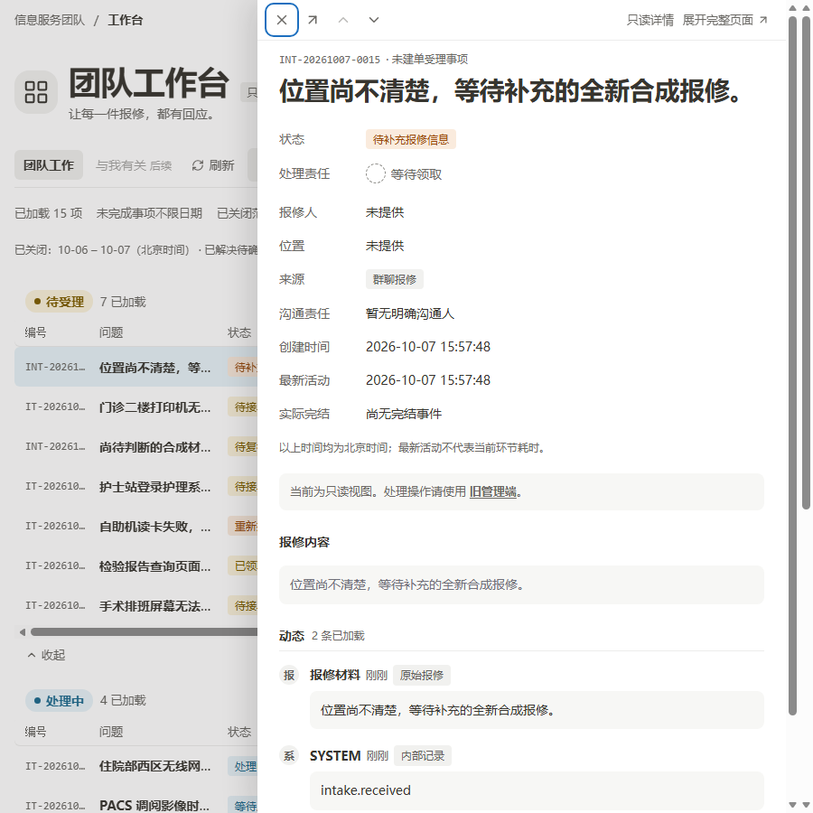
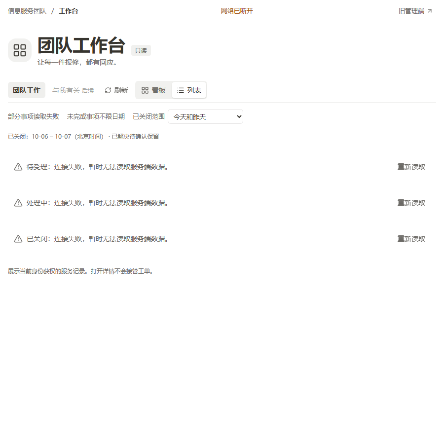

# WEB01 主界面规范对齐

2026-10-07。根据[业务设计](../../admin-workbench-design.md)与[UI 代码规范](../../yixiaoxiu-ui-design-spec.md)调整正式主界面。以下为全新合成 PostgreSQL → 真实 HTTP → 正式生产 bundle 的截图；编号、记录、授权和时间仍来自服务端。截图的捕获源码、源输入哈希、尺寸与 SHA-256 见 [screenshots.json](screenshots.json)。

## 看板调整前后

首版 WEB01，保留原始截图：

规范对齐后的 1920 × 1080：

数据仍为待受理7、处理中4、已关闭4。每列默认显示三项，其余可展开；数量标注为已加载范围，折叠不等于服务器筛选或总数统计。中性灰字体与轻阴影替换偏绿细字和卡片描边，真实细分状态分别采用黄、橙、蓝、绿标签，来源保持中性。

## 列表、抽屉与完整页面

列表整行链接与卡片均打开同一详情，选中项高亮。抽屉保留背景位置，支持首尾 Tab 循环、Esc/遮罩关闭、恢复触发项焦点、已加载授权范围的前后项，以及完整页面展开/刷新。处理责任与沟通责任分别展示；内部记录、对外摘要和原始报修有明确文字标记。

## 1280px 与 900px

900px 以下隐藏侧栏、看板改单列，列表自身可横向滚动，body 不溢出；离线提示在刷新前即可见。仅抽屉打开和图标响应操作有微动效，没有页面加载入场，尊重减少动态效果设置。

## 业务口径与能力边界

关闭范围采用已确认的北京时间今天和昨天，并明确显示日期，未改为原型的滚动24小时。表格以实际已有的来源替代缺少事实的分类字段；时间标注为最新活动，不冒充环节耗时。没有生成在线人数、SLA、需跟进统计或补充条数，没有加入模拟写按钮、拖动状态、评论或真实发送。完整适配说明见[页面映射](../../admin-workbench-web01-map.md#2026-10-07-主界面规范对齐)。

类型、构建、真实 HTTP、Edge/Chrome、现有 selection 截图归档与独立两轴审查的最终结果见 PR #55 正文；不据视觉截图宣称生产验收。首版和原型的历史 PNG、原截图收据及用户原文件均保留。
